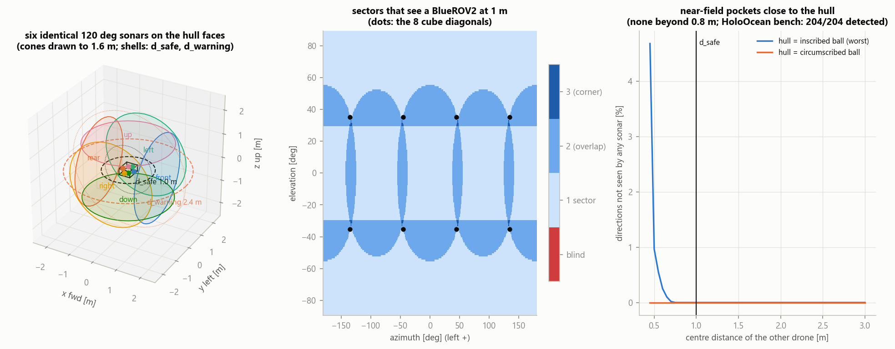
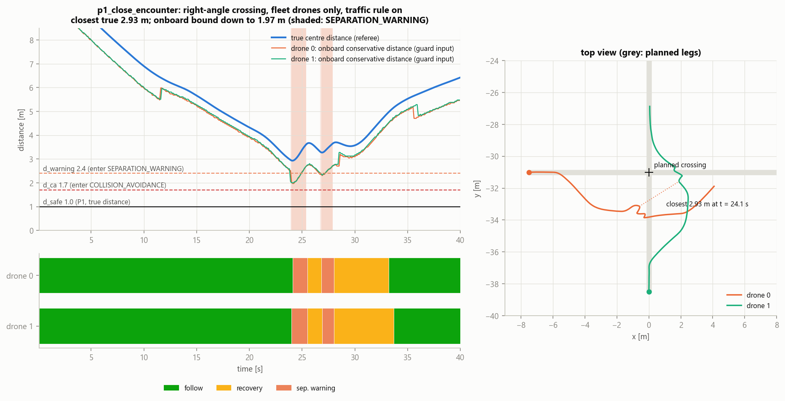
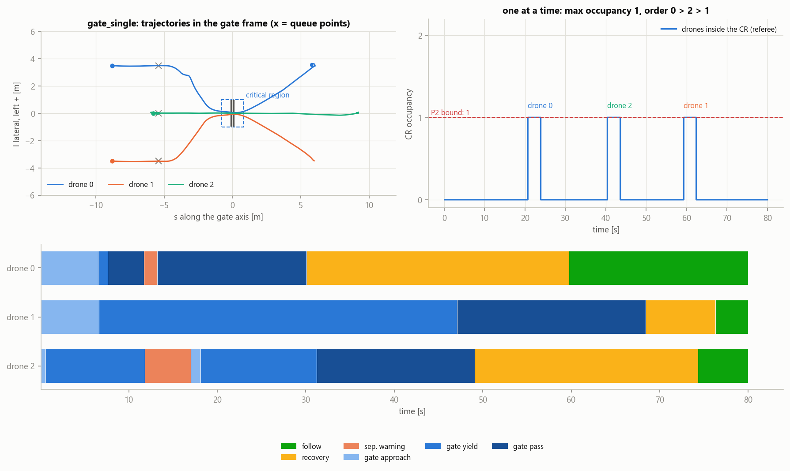
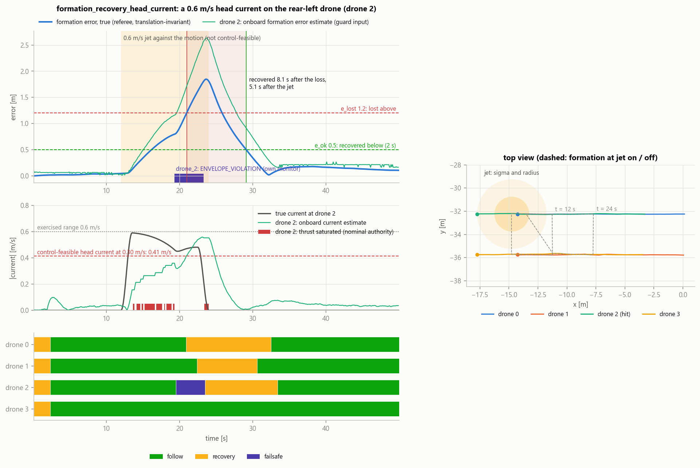
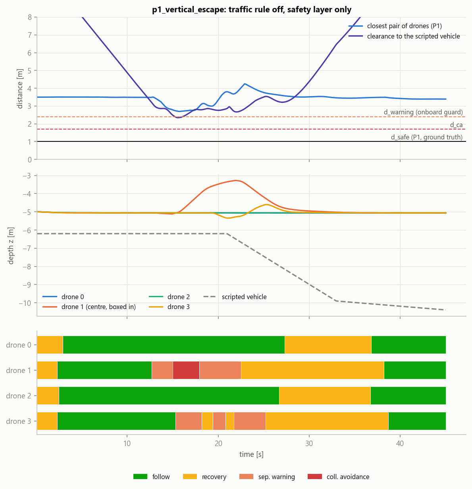
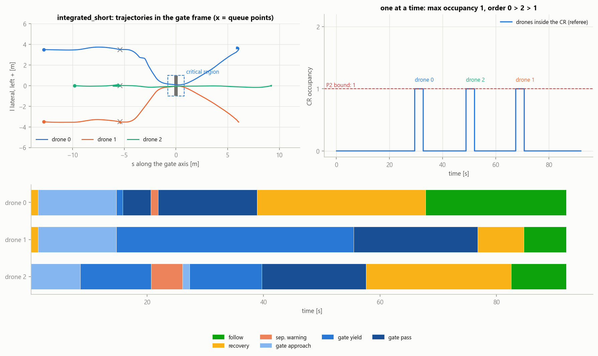
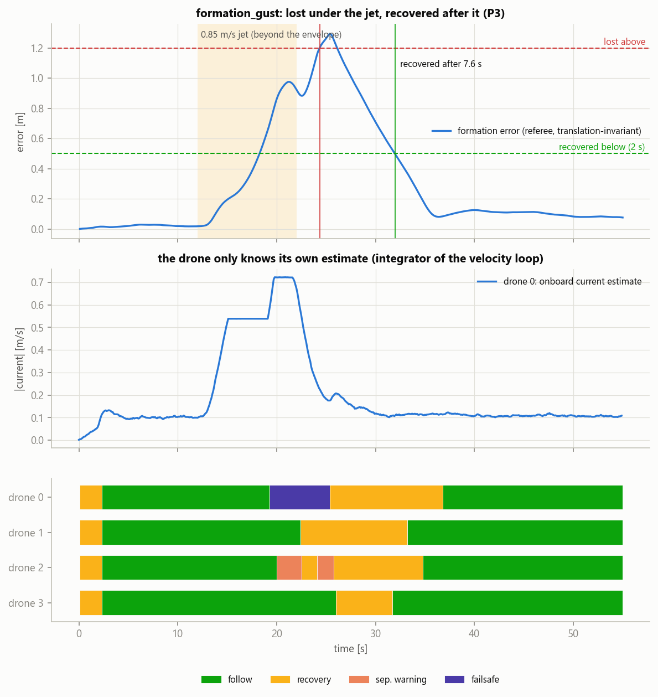

# HoloFleet-HA v2: a leaderless, communication-free UUV fleet with realistic six-sonar sensing and verifiable local hybrid automata

Simulated BlueROV2 drones (HoloOcean 2.3.0, patched) survey in formation, cross a narrow gate of the
existing **Marine Race Arena** one at a time and avoid each other in 3-D.  They have **no leader**,
**exchange no messages** and **all run the same local hybrid automaton**.  Each drone sees its
surroundings only through **six identical wide-beam directional single-beam sonars** (one per hull
face) plus DVL, IMU, compass and depth.  The fleet behaviour is the composition
`H_fleet = H_1 || ... || H_N`; the drones are coupled only through the water they observe.

The coordination is **decentralized and communication-free, driven by shared mission constraints and
local sensing**.  The drones share, before the dive:
* the mission plan, with its formation clock;
* the formation template;
* the gate map;
* the automaton rules.

At runtime they exchange no message.  The formation is not "emergent": every drone tracks its own slot
of a shared plan and corrects it with what its sonars see.

| | property | formula | how it is established |
|---|---|---|---|
| **P1** | inter-vehicle separation (safety) | `G( forall i != j : d_ij >= d_safe )`, d_safe = 1 m (ground truth) | Z3: pairwise radial model with the one-sided onboard distance (BMC + k-induction), exhaustive escape-table lemmas on the deployed planner, triangle and blackout lemmas; numeric soundness of the distance bound; HoloOcean referee |
| **P2** | critical-region mutual exclusion (safety) | `G( sum_i inside_CR_i <= 1 )` | Z3: sector-pattern priority rule on the bearing model, exactly one priority in abreast queues of 2..6, timed model of the occupancy latch; queue geometry checks; HoloOcean referee |
| **P3** | formation recovery (liveness) | `G( formation_lost -> F formation_recovered )`, no time bound | Z3: ranking functions on the formation law under explicit fairness assumptions; HoloOcean referee with measured recovery times |

Ground truth is read only by the **referee** (and by the dashboard's referee half).  Tests scan the
controller code and check at runtime which sensor keys reach a controller.

> [REPORT.md](REPORT.md): results, proofs, assumptions, limits.  [DESIGN_ITERATIONS.md](DESIGN_ITERATIONS.md):
> every problem met in v2, its cause and the fix.  [docs/HOLOOCEAN_OCTREE_PATCH.md](docs/HOLOOCEAN_OCTREE_PATCH.md):
> the simulator patch.  [docs/v2/SONAR_PROBE.md](docs/v2/SONAR_PROBE.md): what the sonar really measures.

---

## V2 BASELINE COMPLETE

The v2 baseline is frozen.  Each piece of evidence below is one scenario with one seed, run headless by
`scripts/run_all_demos.py`, judged by the ground-truth referee:
* 0 contacts and 0 messages in every run;
* 0 automaton determinism violations and 0 observation consistency violations in every run.

| aspect | scenario | what it shows | result |
|---|---|---|---|
| SENSING | `sonar_classification` | echo classes on the HoloOcean sonars: gate STRUCTURE, drone DYNAMIC, both in one cone, behind the gate, abeam, SEABED, drone in the clutter (UNKNOWN) | every case as expected |
| P1, preventive | `p1_two_lines` | the traffic rule resolves the head-on encounters: flanked drones give way vertically, outer ones to the right | min 3.19 m; four short SEPARATION_WARNING episodes while passing at 3.2-3.3 m, caused by the loose conservative bound of DOWN+LEFT / LEFT+UP patterns |
| P1, safety layer | `p1_close_encounter` | fleet drones only, traffic rule ON, right-angle crossing with simultaneous arrival: SEPARATION_WARNING keeps them apart | onboard bound 1.97 m (< d_warning 2.4), true min 2.93 m; COLLISION_AVOIDANCE not reached (DI-25) |
| P1, safety layer | `p1_vertical_escape` | traffic rule OFF, a non-cooperative vehicle crosses a T formation: SEPARATION_WARNING, COLLISION_AVOIDANCE, escape UP | min 2.70 m between drones, vehicle clearance 2.35 m |
| P2 | `gate_single` | arena gate G06, abreast queue, one drone at a time, static rank never used | max occupancy 1, min 3.34 m |
| P3, main validation | `formation_recovery_head_current` | a 0.6 m/s jet against the motion (the claimed drift limit) on the rear-left drone of the square | lost at 21.0 s, recovered at 29.1 s: 8.1 s after the loss, 5.1 s after the jet |
| P3, stress test outside the envelope | `formation_gust` | a 0.85 m/s jet (0.94 m/s measured at the drone), beyond the claimed envelope | lost and recovered in 7.6 s |
| INTEGRATED | `integrated_short` | survey, cross-current at the gate, one at a time, re-form beyond the gate | P1 3.32 m, P2 occupancy 1, P3 re-formed 4.9 s after the last passage |

**What P3 evidence means.** `formation_gust` is a stress test outside the envelope: its current is beyond
the claim.  `formation_recovery_head_current` is the main experimental validation of P3, with the
perturbation chosen on principle, not tuned on the outcome:
* the claimed drift limit, against the motion: the direction with the smallest control margin;
* one localized jet;
* on the rear drone, so that the warning filter does not move a neighbour with it.

Its drift stays inside the claimed bound (max 0.59 m/s).  Even so, the hit drone saturates:
* at nominal authority it makes about 0.71 m/s through the water;
* the survey speed is 0.30 m/s;
* after 7 s its own monitor declares ENVELOPE_VIOLATION (FAILSAFE from 19.4 to 23.3 s).

The formation is lost only after that declaration and recovers once the jet ends.  The sequence of the
hit drone is FOLLOW -> FAILSAFE -> RECOVERY -> FOLLOW.  The two front drones go FOLLOW -> RECOVERY ->
FOLLOW, and the rear-right drone stays in FOLLOW.

The run therefore validates P3 as it is proved: recovery after a perturbation that ends.  A formation
loss with every assumption valid was not achievable.  Lateral 0.6 m/s jets give at most 0.47 m of
formation error, a head-on jet on a front drone 0.74 m (`results/v2/design_probes.json`).  The reason is
the design itself, explained in DI-24: the claimed 0.6 m/s does not hold against the motion at survey
speed; the effective bound there is about 0.4 m/s.

## 1. Watch the demos

```bash
conda activate holo_fleet_ha
python scripts/run_demo.py --list
python scripts/run_demo.py --scenario p1_vertical_escape
python scripts/run_demo.py --scenario p1_close_encounter
python scripts/run_demo.py --scenario formation_recovery_head_current
```

Each demo opens the HoloOcean viewport, with the onboard belief drawn on it (nearest echo per sonar
sector: grey structure, brown seabed, red possible vehicle, amber unknown; escape direction in
magenta), and a dashboard:

* **ONBOARD**, per drone:
  * `AUTOMATON mode: ...` and `OBSERVATION CONSISTENT / INCONSISTENT` (the runtime check of the
    observation invariants);
  * estimated pose and the six sectors (range, class, age);
  * the conservative nearest distance and the escape direction;
  * the current estimate, the gate decision and the CR belief;
  * the formation error estimate;
* **REFEREE / GROUND TRUTH**:
  * a top view;
  * P1 SAFE/VIOLATED, with the true nearest distance next to the onboard one, d_warning and d_safe;
  * P2 occupancy and entry order;
  * P3 OK/LOST/RECOVERING/RECOVERED with the formation error;
  * the true current;
* footer:
  * `COMMUNICATION: 0 messages`, `GROUND TRUTH USED BY CONTROLLERS: NO`;
  * the envelope status: the referee's drift, plus any drone that declares its own ENVELOPE_VIOLATION;
  * `AUTOMATON DETERMINISM VIOLATIONS: n`, `OBSERVATION CONSISTENCY VIOLATIONS: n`.

At the end the summary is printed and a GIF is written.  The summary covers P1/P2/P3, collisions,
messages, `AUTOMATON DETERMINISM VIOLATIONS`, `OBSERVATION CONSISTENCY VIOLATIONS` and the envelope.

| scenario | drones | sim time | shows |
|---|---|---|---|
| `sonar_classification` | 2 (bench) | 28 s | echo classes: gate STRUCTURE, drone DYNAMIC, both in one cone, drone behind the gate, abeam, SEABED, drone in the seabed clutter (UNKNOWN) |
| `p1_head_on` | 2 | 30 s | head-on: both give way to the right (sector traffic rule), pass port to port |
| `p1_vertical_escape` | 4 + 1 scripted vehicle | 45 s | traffic rule OFF, safety layer only: a vehicle that does not react crosses a T formation 1.2 m below; the boxed-in centre drone escapes **up** |
| `p1_two_lines` | 6 | 36 s | two survey lines head-on: flanked drones give way **vertically**, outer ones to the right |
| `p1_close_encounter` | 2 | 40 s | right-angle crossing, both drones arrive together; fleet drones only, traffic rule ON, no current: the **warning filter** keeps them apart |
| `formation_triangle` | 3 | 45 s | triangle under a 0.25 m/s lateral current |
| `formation_square` | 4 | 45 s | 2 x 2 box under a 0.30 m/s diagonal current |
| `formation_six` | 6 | 50 s | six swaths abreast (36 sonars), lateral current with a vertical component |
| `formation_recovery_head_current` | 4 | 50 s | a 0.6 m/s jet **against the motion** (the claimed drift limit) hits the rear-left drone: the drone saturates and declares its own envelope violation; the formation is lost and recovered |
| `formation_gust` | 4 | 55 s | stress test **outside the envelope**: a 0.85 m/s jet breaks the square; P3 lost and recovered |
| `gate_single` | 3 | 80 s | arena gate G06 (1.5 m opening): abreast queue, one at a time, re-form beyond the gate |
| `integrated_short` | 3 | 92 s | survey, 0.35 m/s cross-current at the gate, one at a time, re-form |

`--headless` runs without the HoloOcean window, `--no-window` without the dashboard window.
`python scripts/run_all_demos.py` runs everything headless (15-30 min) and writes
`results/v2/demos/SUMMARY.md`; `python scripts/render_demo.py results/v2/demos/<scenario>` rebuilds
the dashboard GIF from the logs.  Small GIF copies are in [figures/v2/gifs/](figures/v2/gifs/).

## 2. Architecture

```mermaid
flowchart LR
  subgraph SIM["holo_fleet.sim (owns ground truth)"]
    HO[HoloOcean 2.3.0 + octree patch<br/>OpenWater + arena gate G06] -->|onboard sensors only| F[SensorFrame per drone]
    HO -->|PoseSensor, VelocitySensor, CollisionSensor| R[Referee P1/P2/P3]
    C[current field] --> HO
    X[scripted vehicle<br/>(optional, not in the fleet)] --> HO
  end
  subgraph DRONE["perception + ha + control (identical on every drone)"]
    F --> P[Perception<br/>dead reckoning, six echo profiles,<br/>STRUCTURE/SEABED/DYNAMIC/UNKNOWN,<br/>sector targets, gate belief, formation check]
    P -->|abstract observation| OC[Observation consistency check<br/>shared invariants N0-N1, I1-I4<br/>violation: logged, sense_ok = False]
    OC --> A[Local hybrid automaton<br/>8 modes, shared guard spec]
    A --> FL[Mode flows<br/>formation / traffic rule / gate / warning filter / 3-D escape / failsafe]
    FL --> LL[DVL velocity PI + heading loop<br/>onboard current estimate]
  end
  LL -->|8 thrusters| HO
  SPEC[ha/spec.py, ha/gate_rule.py,<br/>ha/observation_invariants.py] --- A
  SPEC --- OC
  SPEC --- Z3[formal/ Z3 checks]
  R --> UI[dashboard: ONBOARD vs REFEREE]
  A --> UI
```

```text
holo_fleet/
  config.py                    every threshold, gain and envelope assumption (runtime AND proofs)
  mission.py, formations.py    mission plan, FormationClock (holds, rendezvous jumps), generic templates
  arena_bridge.py              re-use of ~/Desktop/HoloDroneCompetition/marine_race_arena (tracks, gates, spawner)
  ha/spec.py, ha/automaton.py  hybrid automaton: edge table written once for Python and Z3, determinism monitor
  ha/gate_rule.py              sector-pattern priority rule (shared with Z3)
  ha/observation_invariants.py semantic invariants of the abstract observation: runtime consistency check
                               and the domain of every Z3 suite (one definition)
  perception/                  sonar geometry and region tables, echo classifier, targets and the sound distance
                               bound, gate perception (occupancy latch), formation perception, dead reckoning
  control/                     flows, 3-D escape planner, low level
  sim/                         HoloOcean wrapper, patched-engine setup, watchdog, currents, scenarios
  referee/                     ground-truth validator (the only reader of simulator state)
  ui/                          dashboard, live hook, GIFs
formal/                        Z3 suites determinism / observation consistency / P1 / P2 / P3 -> formal/results/SUMMARY.md
scripts/                       demos, figures, assumption validation, sonar bench, plant calibration
probe/                         sonar probe, octree regression, benches
patches/                       HoloOcean octree patch + build/install script
```

## 3. Sensors: six identical wide-beam directional single-beam sonars

| sensor | HoloOcean type | mounting | range | rate | noise |
|---|---|---|---|---|---|
| FRONT, REAR, LEFT, RIGHT, UP, DOWN | `SinglebeamSonar`, 120 deg cone, 234 bins (5 cm) | one per hull face, 1 cm outside the hull, along the face normal; only position and orientation differ | 0.3-12 m | 10 Hz | intensity Rayleigh 0.05 + multiplicative 0.1, range exponential 0.05 m; threshold 0.30 |
| DVL | `DVLSensor`, 4 beams at 22.5 deg | hull bottom | 50 m | 10 Hz | 0.01 m/s, range 0.02 m |
| IMU, compass, depth | `IMUSensor`, `MagnetometerSensor`, `DepthSensor` | sockets | - | 30 Hz | 0.01 / 0.005 / 0.02 |

A sonar returns the echo intensity per range bin over its whole cone: **no bearing inside the cone**.
What a drone knows about another hull is the **sector pattern** (which sonars see it) and one range per
sector.  The 25-ray ring, the imaging sonar and every artificial proximity sensor of v1 are gone.



* **3-D coverage.** Six 60 deg half-angle cones cover the sphere (the worst directions, the 8 cube
  diagonals, are 54.7 deg from three axes and are seen by three sonars).  For a hull at 1 m and beyond
  every direction is seen; near-field pockets exist only closer than 0.8 m (centre distance), below
  d_safe.  HoloOcean bench: 204/204 placements (axes, edges, diagonals; 1-5 m) detected, sector pattern
  always within the geometric prediction (`scripts/sonar_bench.py coverage`).
* **Echo classes** (onboard information only: own estimated pose, depth, DVL altitude, gate map):
  `STRUCTURE` (inside the gate-map window), `SEABED` (cone meets the bottom known from depth and DVL
  altitude), `DYNAMIC` (compact, unexplained: a possible vehicle), `UNKNOWN` (extended or inside the
  seabed clutter: treated as an obstacle), `UNCONFIRMED` (seen once; M-of-N confirmation 2 of 3).
  HoloOcean bench, all cases as expected: gate only, drone only, drone in front of the gate, two drones
  in one cone, seabed, drone before the seabed onset, drone hidden in the clutter (never declared a
  clear vehicle; the guards get a conservative UNKNOWN target).
* **Sector model.** Per sector: nearest obstacle range, class, age, filtered closing rate.  Echoes of
  adjacent sectors at similar ranges form a target whose pattern narrows its direction to a region.
* **Conservative distance.** A **sound** lower bound of the centre distance per target (DI-13): never
  above the true distance on 10^5 random hull poses (formal S0), minus c_max x age for staleness.

Requires the **HoloOcean octree patch** (runtime props visible, no ghosts, no crash, every agent
visible): see [docs/HOLOOCEAN_OCTREE_PATCH.md](docs/HOLOOCEAN_OCTREE_PATCH.md).

## 4. Behaviour

* **P1.**
  * `SEPARATION_WARNING`: the conservative distance is below d_warning = 2.4 m. A 3-D velocity filter
    keeps the velocity closest to the mission one that opens every threat region at >= 0.2 m/s.
  * `COLLISION_AVOIDANCE`: the distance is below d_ca = 1.7 m. The escape direction maximises the
    certified worst-case opening, preferring free sectors, the onboard current estimate, the mission
    direction and the depth band. Vertical escapes are included.
  * A mission-level traffic rule removes head-on encounters before the warning band: give way to the
    right, or vertically when the right is occupied.
  * Crossing encounters are left to the warning filter, because the rule's give-way cannot resolve
    them (`p1_close_encounter`, DI-25).
* **P2.**
  * Drones queue abreast before the gate, at a line computed so that the CR lies inside every queue
    sonar's FRONT cone.
  * Each drone WAITs for anything ahead of it or on its left. Otherwise it has PRIORITY, held for
    1 s.
  * A drone commits only with PRIORITY and a FREE belief about the CR. The belief is BUSY on a
    corridor echo, stays BUSY while the bars mask the crossing drone, and is FREE only after an echo
    beyond the CR plus t_clear.
  * The static rank is a last resort, used only for vertically stacked neighbours. Uses are counted:
    0 in every run.
* **P3.**
  * Generic templates (triangle 3, square 4, line of 6) share one controller. Each drone tracks its
    own slot with dead reckoning and a FormationClock that is part of the plan.
  * Sonar range residuals to the expected neighbours correct the lateral spacing and the progress.
  * Recovery runs at up to 0.5 m/s.
  * Beyond a gate the reference jumps to a rendezvous and waits a planned time budget.
* **Observation consistency** (perception -> automaton).
  * Every abstract observation is checked against the invariants that the perception guarantees by
    construction (`ha/observation_invariants.py`):
    * well-formed numbers and ranges;
    * `has_prio -> at_queue`;
    * `at_queue -> gate_zone`;
    * `passed -> !gate_zone`;
    * `t_ok > 0 -> form_err < e_ok & neighbors_ok`.
  * A violation reveals a perception defect. It is logged as `OBSERVATION_INCONSISTENT` (drone, time,
    invariant, values), and the automaton receives the observation with `sense_ok = False`: the
    existing fault edge to FAILSAFE_HOLD_OR_RETREAT, no new mode.
  * Latched beliefs that may legitimately persist (occupancy, the commit latch) are not constrained.

## 5. Results (HoloOcean, one seed per scenario, `results/v2/demos/SUMMARY.md`)

| scenario | drones | P1 min distance [m] (d_safe 1.0) | P2 max CR occupancy | P3 episodes: recovery [s] (after the perturbation) | contacts | messages | current drift / vehicle envelope | determinism / observation violations | static rank uses | RTF (with cameras) |
|---|---|---|---|---|---|---|---|---|---|---|
| `p1_head_on` | 2 | 4.044 | - | n/a | 0 | 0 | inside / ok | 0 / 0 | 0 | 1.025 |
| `p1_vertical_escape` | 4 | 2.697 (vehicle clearance 2.35) | - | 18.1 (10.0) | 0 | 0 | inside / ok | 0 / 0 | 0 | 0.953 |
| `p1_two_lines` | 6 | 3.188 | - | n/a | 0 | 0 | inside / ok | 0 / 0 | 0 | 1.023 |
| `p1_close_encounter` | 2 | 2.931 | - | n/a | 0 | 0 | inside / ok | 0 / 0 | 0 | 0.916 |
| `formation_triangle` | 3 | 4.598 | - | never lost | 0 | 0 | inside / ok | 0 / 0 | 0 | 0.863 |
| `formation_square` | 4 | 3.450 | - | never lost | 0 | 0 | inside / ok | 0 / 0 | 0 | 0.937 |
| `formation_six` | 6 | 3.447 | - | never lost | 0 | 0 | inside / ok | 0 / 0 | 0 | 1.074 |
| `formation_recovery_head_current` | 4 | 3.293 | - | 8.1 (5.1) | 0 | 0 | inside / 1 self-declared violation | 0 / 0 | 0 | 1.015 |
| `formation_gust` | 4 | 2.710 | - | 7.6 (6.3) | 0 | 0 | OUT (0.94 m/s) / 1 self-declared violation | 0 / 0 | 0 | 1.029 |
| `gate_single` | 3 | 3.342 | 1 | 68.8 (5.0) | 0 | 0 | inside / ok | 0 / 0 | 0 | 1.068 |
| `integrated_short` | 3 | 3.320 | 1 | 69.1 (4.9) | 0 | 0 | inside / ok | 0 / 0 | 0 | 0.844 |

All runs are COMPLETE, and no controller uses ground truth.

How to read the columns:
* **P3 recovery** is measured from the loss.  In brackets it is measured from the end of the last
  perturbation (jet, encounter, last gate passage).  In the gate scenarios the abreast queue breaks the
  formation on purpose and the drones re-form at the rendezvous.
* **Vehicle envelope** is the drone's own view.  A self-declared violation means persistent thrust
  saturation: the current is stronger than the drone at the commanded speed.

`formation_recovery_head_current`:
* the drift stays within the claimed 0.6 m/s;
* the hit drone still declares the violation, because the current opposes its motion (DI-24).

`p1_close_encounter` (DI-25):
* both drones enter SEPARATION_WARNING twice: at 24.0 / 23.9 s, then 26.7 / 26.8 s;
* the conservative distance goes down to 1.97 m, while the true one never goes below 2.93 m;
* the true distance was 2.96 m at the first intervention, and the pair closed at 0.19 m/s there;
* they then open at up to 0.67 m/s;
* the warning filter's directions are REAR+RIGHT and FWD+RIGHT, from the FRONT+LEFT / LEFT and
  LEFT+REAR sectors;
* collision avoidance is not reached.

Formal verification: **136 checks, all with the expected verdict**:
* local determinism & priority hierarchy: 66/66;
* observation consistency: 27/27;
* P1 inter-vehicle separation: 13/13;
* P2 critical-region mutual exclusion: 19/19;
* P3 formation recovery: 11/11.

Details are in [formal/results/SUMMARY.md](formal/results/SUMMARY.md).  The assumptions measured on these
runs are in [results/v2/ASSUMPTIONS.md](results/v2/ASSUMPTIONS.md); E2, the vehicle's own envelope, fails
only on `formation_recovery_head_current`, as described above.

| P1 | P2 | P3 |
|---|---|---|
|  |  |  |
|  |  |  |

## 6. Performance (6 sonars per drone, 10 Hz, controller 10 Hz)

| drones x sonars | mean tick [ms] | p95 tick [ms] | real-time factor | sonar rate (sim time) |
|---|---|---|---|---|
| 1 x 6 = 6 | 15.28 (gate scene 15.97) | 19.38 (22.25) | 2.182 (2.087) | 10.0 Hz |
| 3 x 6 = 18 | 14.73 (gate scene 14.33) | 18.0 (17.63) | 2.264 (2.325) | 10.0 Hz |
| 4 x 6 = 24 | 15.27 (gate scene 14.92) | 20.25 (19.42) | 2.183 (2.234) | 10.0 Hz |
| 6 x 6 = 36 | 15.09 (gate scene 15.46) | 20.8 (20.46) | 2.208 (2.155) | 10.0 Hz |

Bench without cameras (`scripts/sonar_bench.py perf`, pinned drones): the six sonars per drone cost
almost nothing extra; the tick is dominated by the engine.  With the two RGB visualisation cameras of
the demos (800 x 450, 5 Hz) the real-time factor was 0.84-1.07 in the final runs (table in section 5; about 0.6 on a busier machine).  The
controllers of all drones together take 2.5-8.6 ms per 0.1 s step.  Trade-offs kept on purpose:
6 cm octree leaves (structure echoes accurate to one bin), 234 bins, 10 Hz sonars; cameras are for
visualisation only and can be removed for speed.

## 7. Installation

```bash
conda create -n holo_fleet_ha --clone ocean -y        # the arena's env is left untouched
conda activate holo_fleet_ha
pip install z3-solver imageio
pip install -e .
pip install -e F:\Andrea\holoocean-octree-patch\client --no-deps     # patched HoloOcean client
powershell -ExecutionPolicy Bypass -File patches/build_and_install_patched_holoocean.ps1   # patched engine (UE 5.3)
```

`holo_fleet/sim/holoocean_setup.py` points `HOLODECKPATH` to the patched root
(`F:\Andrea\holoocean_patched_root`); the official HoloOcean installation is never modified.  The arena
is imported from `~/Desktop/HoloDroneCompetition` (override with `MARINE_RACE_ARENA_ROOT`).

## 8. Commands

```bash
python formal/check_properties.py                         # all Z3 suites -> formal/results/SUMMARY.md
python -m pytest -q -m "not slow and not holoocean"       # fast tests (~1 min)
python -m pytest -q                                       # all tests (incl. Z3 P1/P2 suites and the octree regression)
python scripts/run_all_demos.py                           # every demo, headless -> results/v2/demos/
python scripts/make_figures_v2.py                         # figures/v2/
python scripts/validate_assumptions_v2.py                 # results/v2/ASSUMPTIONS.md
python scripts/experiment_metrics.py results/v2/demos/p1_close_encounter    # per-run P1 / P3 metrics
python probe/octree_rebuild_regression.py                 # simulator patch regression
python scripts/sonar_bench.py coverage|classify|perf      # sensor benches
```

A run folder `results/v2/demos/<scenario>/` holds `run_status.json` (`INCOMPLETE` until the run ends),
`run_config.json`, `events.jsonl` (automaton decisions, envelope violations), `drone_<k>_state.jsonl`
(onboard: mode, pose estimate, sectors, targets, escape, gate belief, formation check),
`onboard_summary.json`, `referee_timeseries.csv` and `referee_metrics.json` (ground truth),
`experiment_summary.json` (encounter and recovery metrics), `perf.json`, `summary.csv`, the dashboard GIF.

## 9. What is proved, validated, outside the envelope, not claimed

**FORMALLY VERIFIED (Z3, on abstractions whose guards are the runtime code):**
* the local automaton is deterministic and complete, and its priority hierarchy holds
  (fault > collision avoidance > warning > gate > formation);
* P1 for a pair: radial model with the one-sided onboard distance, unbounded by k-induction, with
  smallest verified d_warning 1.84 m against 2.4 m configured;
* P1 sensing and escape lemmas, evaluated on the deployed planner over every sector pattern:
  * single-threat escape >= g_min;
  * warning filter >= v_open;
  * two threats within 90 deg;
  * vertical escapes for FRONT+DOWN / FRONT+UP;
  * triangle and blackout lemmas;
* P2: never two PRIORITY within the heading tolerance; exactly one PRIORITY in abreast queues of 2..6
  drones; the occupancy latch never lets a second drone into the CR for every queue view (n = 3, 4);
  queue geometry for n = 2..6;
* P3: eventual recovery by ranking functions (no time bound) under fairness assumptions A1-A4, and
  the automaton edges FOLLOW <-> RECOVERY;
* observation consistency:
  * the invariants of the abstract observation are satisfiable and independent;
  * every edge is enabled on some consistent observation (the proofs are not vacuous);
  * a consistent observation enables exactly one edge;
  * the runtime monitor sends any inconsistent observation, and only it, to FAILSAFE through the
    existing fault edge;
* every suite has mutation tests with their expected verdict (a counterexample, or a lost
  reachability for the v1 observation domain).

**VERIFIED NUMERICALLY, not by Z3:**
* the onboard distance bound is never above the true distance (10^5 poses);
* the escape-table guarantees, by exhaustive evaluation of the deployed planner with a certified
  sampling error;
* the queue geometry facts.

**EMPIRICALLY VALIDATED (HoloOcean, ground-truth referee, one seed each):**
* P1, P2 and P3 hold in all eleven demos, with zero contacts and zero messages;
* automaton determinism violations 0 and observation consistency violations 0 in every run;
* the formal assumptions, measured back on the logs (`results/v2/ASSUMPTIONS.md`): onboard distance
  never above the true one, sonar data age, closing speeds, queue holding, crossing speed;
* sonar coverage (204/204 placements) and echo classification (bench A-F);
* the octree patch regression.

**OUTSIDE THE FORMAL ENVELOPE (shown, flagged, not covered by the proofs):**
* `formation_gust`, a stress test: a 0.85 m/s jet, above the 0.6 m/s claimed. The drone declares
  ENVELOPE_VIOLATION and the referee flags it.
* `formation_recovery_head_current`:
  * the drift stays within the claimed 0.6 m/s, but it opposes the motion;
  * the hit drone cannot make way at the survey speed (about 0.71 m/s through the water at nominal
    authority) and declares its own ENVELOPE_VIOLATION;
  * the P1 assumption w_drift_max and P3's A3 do not hold while it saturates (DI-24).
* `p1_vertical_escape`: the scripted vehicle does not run the protocol. Its clearance is reported
  separately from P1.
* Two drones masked at the same time by a mapped structure.
* A committed drone stopping inside the gate longer than t_occ_max.
* Drones inside the seabed clutter (only a conservative UNKNOWN reaction).

**NOT CLAIMED:**
* a proof over HoloOcean's continuous physics;
* proofs for arbitrary N (P1 is pairwise plus the triangle lemma; P2 is checked for queues of 2..6);
* statistical performance: there are no multi-seed campaigns;
* real-sea acoustics such as multipath, surface reflections and real beam patterns;
* static-obstacle avoidance beyond the mapped gate.
