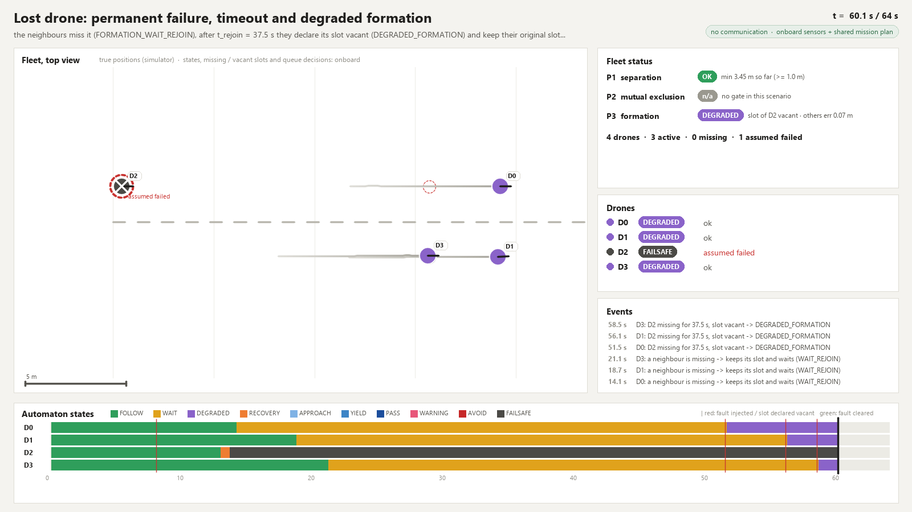
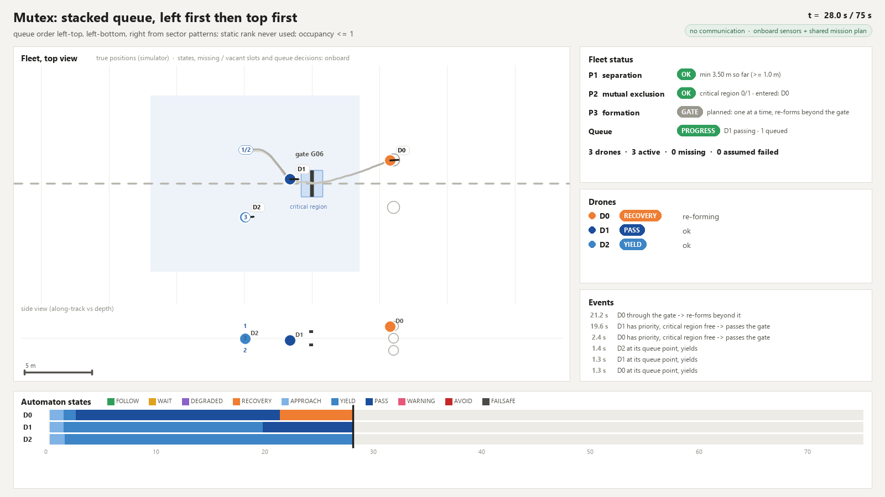
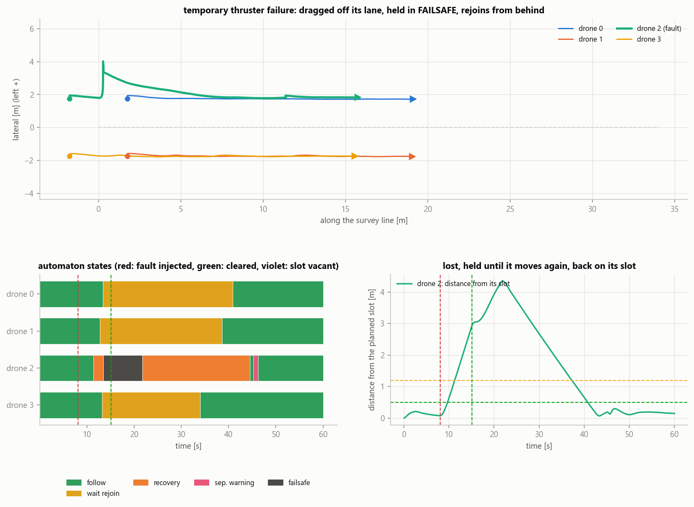
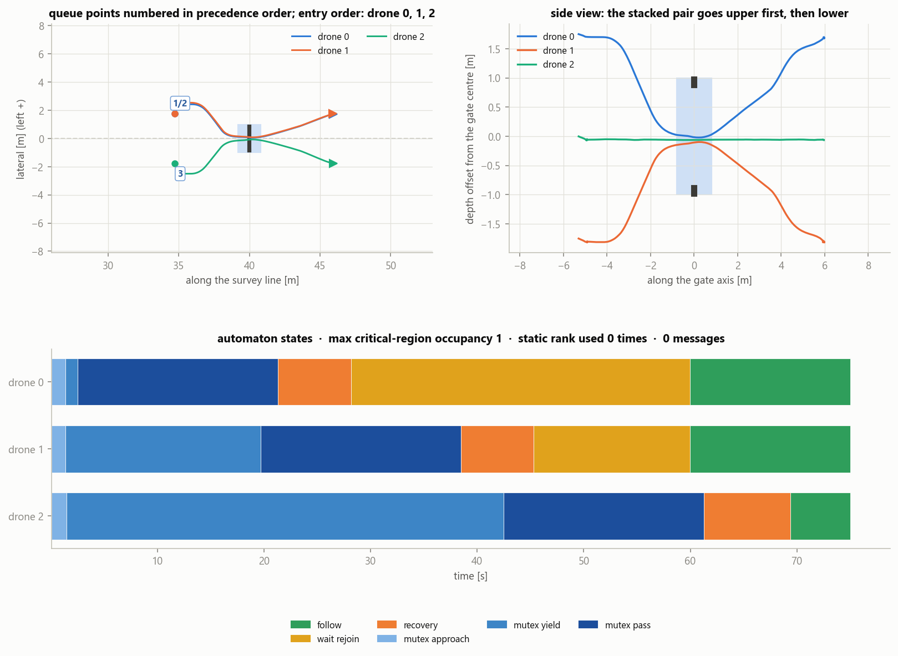
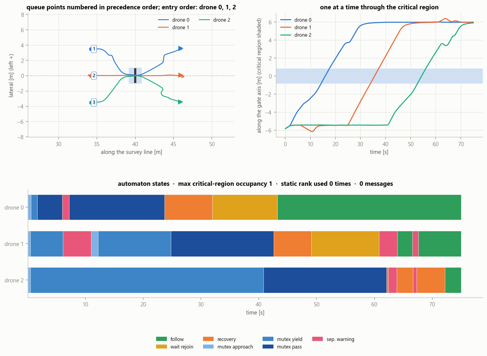
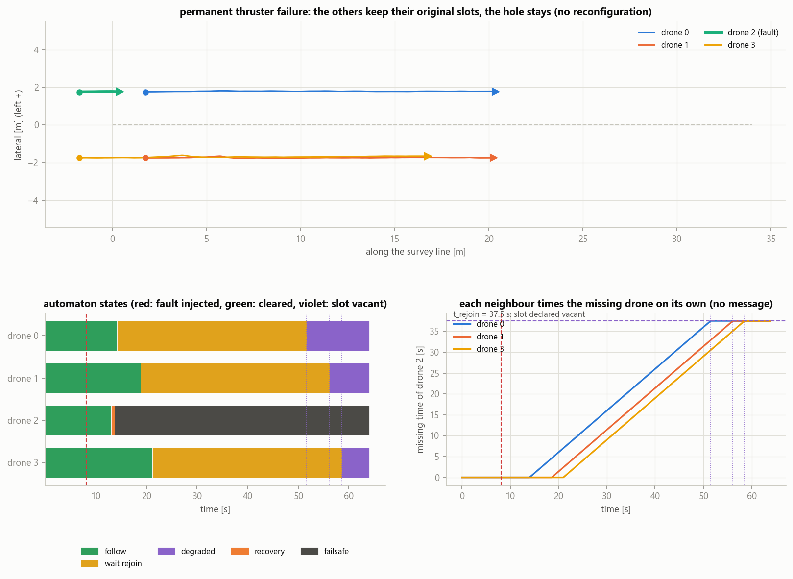
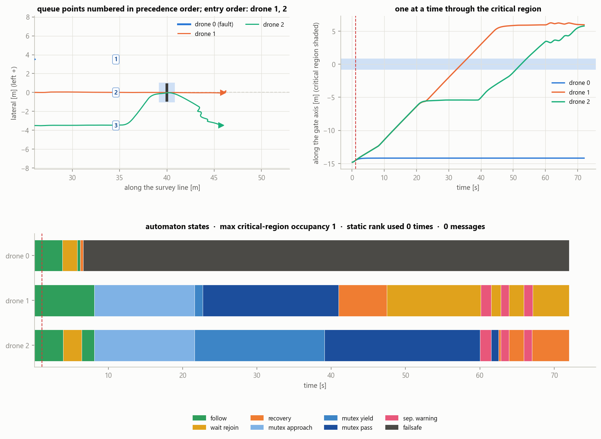

# HoloFleet-HA v2: a leaderless, communication-free UUV fleet with realistic six-sonar sensing and verifiable local hybrid automata

Simulated BlueROV2 drones (HoloOcean 2.3.0, patched) survey in formation, cross a narrow gate of the
existing **Marine Race Arena** one at a time and avoid each other in 3-D.  They have **no leader**,
**exchange no messages** and **all run the same local hybrid automaton**.  Each drone sees its
surroundings only through **six identical wide-beam directional single-beam sonars** (one per hull
face) plus DVL, IMU, compass and depth.  The fleet behaviour is the composition
`H_fleet = H_1 || ... || H_N`; the drones are coupled only through the water they observe.

The coordination is **decentralized and communication-free, driven by shared mission constraints and
local sensing**.  The drones share, before the dive:
* the mission plan, with its formation clock;
* the formation template;
* the gate map;
* the automaton rules.

At runtime they exchange no message.  The formation is not "emergent": every drone tracks its own slot
of a shared plan and corrects it with what its sonars see.

| | property | formula | how it is established |
|---|---|---|---|
| **P1** | inter-vehicle separation (safety) | `G( forall i != j : d_ij >= d_safe )`, d_safe = 1 m (ground truth) | Z3: pairwise radial model with the one-sided onboard distance (BMC + k-induction), exhaustive escape-table lemmas on the deployed planner, triangle and blackout lemmas; numeric soundness of the distance bound; HoloOcean referee |
| **P2** | critical-region mutual exclusion (safety) and progress of the queue | `G( sum_i inside_CR_i <= 1 )` | Z3: sector-pattern precedence (left first, then top first) on the bearing model, exactly one priority for every occupancy of abreast queues of 2..6 with at most one vacant point between neighbours, stacked queues numerically, timed model of the occupancy latch; queue geometry checks; HoloOcean referee |
| **P3** | formation recovery (liveness) | `G( formation_lost -> F formation_recovered )`, no time bound; P3-deg for a drone that never comes back | Z3: ranking functions on the formation law under explicit fairness assumptions; bounded waiting for a missing neighbour (ranking function on its timer); HoloOcean referee with measured recovery times and the degraded verdict |

Ground truth is read only by the **referee** (and by the fleet view, to draw the true positions).  Tests scan the
controller code and check at runtime which sensor keys reach a controller.

> [REPORT.md](REPORT.md): results, proofs, assumptions, limits.  [DESIGN_ITERATIONS.md](DESIGN_ITERATIONS.md):
> every problem met in v2, its cause and the fix.  [docs/HOLOOCEAN_OCTREE_PATCH.md](docs/HOLOOCEAN_OCTREE_PATCH.md):
> the simulator patch.  [docs/v2/SONAR_PROBE.md](docs/v2/SONAR_PROBE.md): what the sonar really measures.

---

## LOST DRONES, MUTEX ZONE, FLEET VIEW (v2.1)

Still **no communication of any kind**: no inter-drone message, no acoustic ping, no heartbeat.  A drone
uses only its own sensors and navigation and the mission plan shared before the dive (path, formation
clock, template, gate map, automaton rules).

**Automaton: 10 modes** (two added), priority
`FAILSAFE > COLLISION_AVOIDANCE > SEPARATION_WARNING > MUTEX (PASS, YIELD, APPROACH) > FORMATION_RECOVERY >
formation keeping (FORMATION_WAIT_REJOIN, DEGRADED_FORMATION, FORMATION_FOLLOW)`.

| mode | when | what the drone does |
|---|---|---|
| FORMATION_FOLLOW | own slot ok, every expected neighbour seen | follows its slot on the shared clock |
| **FORMATION_WAIT_REJOIN** (new) | own slot ok, an expected neighbour missing | keeps its slot, follows the clock at the survey speed, times the absence |
| **DEGRADED_FORMATION** (new) | the missing neighbour's slot was declared vacant after t_rejoin = 37.5 s | keeps its ORIGINAL slot; the vacant slot stays empty (no reconfiguration); re-included if the drone comes back |
| FORMATION_RECOVERY | own slot error > e_lost (or after a gate / an avoidance) | recovers its own slot at up to 0.5 m/s, **from behind along its own lane** when it is off its lane |
| MUTEX_APPROACH / MUTEX_YIELD / MUTEX_PASS | the gate's mutual-exclusion zone (renamed from GATE_*) | queue, wait, pass one at a time |

**Lost drone, step by step.**
1. A drone that is lost (dragged by a current, thrusters failing, too far behind) is not seen where its
   neighbours expect it: after 1 s they mark it MISSING and enter FORMATION_WAIT_REJOIN.  They do not slow
   down: without communication a slowdown could not be applied consistently by the whole fleet.
2. The lost drone recovers its own slot (FORMATION_RECOVERY, 0.2 m/s faster than the clock); if it is off its
   lane it lets the fleet pass, moves to its own lane behind the formation and then advances along it.  Its
   neighbours count it back only when it is confirmed near its slot (three associations within 1 s), then
   return to FORMATION_FOLLOW.
3. If it does not come back within t_rejoin = 7.5 m / (0.5 - 0.3) m/s = 37.5 s of formation time (the time a
   drone at the edge of the sensing range needs to catch up), each neighbour declares its slot vacant on its
   own and continues in DEGRADED_FORMATION on its original slot.  The timers do not run during planned holds
   (rendezvous beyond a gate) nor while the drone itself is lost, avoiding or in a gate.
4. A drone whose thrusters fail detects it itself: persistent saturation -> ENVELOPE_VIOLATION -> FAILSAFE.
   In FAILSAFE it adds a small heave probe and clears the violation only when it has really moved as asked
   (DVL), so a dead drone stays in FAILSAFE instead of cycling.

**Mutual-exclusion zone (gate).**  Precedence from sector patterns, simple and visible:
* LEFT first (a neighbour ahead or on the left: wait);
* then TOP first, when useful (a neighbour only above: wait; only below: go);
* a static rank only as the very last tie-break, for a pattern that cannot be ordered (UP and DOWN at once);
  it is the queue order of the shared plan, so it never contradicts the geometry.  Used 0 times.

The v2 rule had a latent deadlock: two vertically stacked queued drones both waited for an unknown rank
(formal mutation M2m).  Stacked templates now queue in columns 5 m apart, one drone above the other, at a
queue line where the gate frame never hides a neighbour (M2v, M4f).  Progress: for every occupancy with at
most one vacant queue point between neighbours exactly one queued drone has priority (M2, 96 occupancies of
abreast queues of 2..6; M2v, the stacked queues).

**Fleet view** (live and in the GIFs): top view with the common path, the planned slots (a vacant one
marked), every drone coloured by its state with a short trail, the gate with its critical region and the
queue points numbered in precedence order (and a side view for depth layers); P1 / P2 / P3 status, queue
progress, active / missing / assumed-failed drones; one row per drone; readable events; a timeline of the
automaton states.

| scenario | sim time | what happens | result |
|---|---|---|---|
| `lost_drone_rejoin` | 60 s | the rear-left drone's thrusters fail from 8.1 to 15.1 s (simulator fault, no drone told); the 0.35 m/s lateral current drags it 2.2 m off its lane | it detects the fault itself (ENVELOPE_VIOLATION at 13.3 s, FAILSAFE until its heave probe is delivered at 21.5 s), returns to its lane behind the fleet (TO_LANE) and advances along it, FOLLOW at 44.4 s; the three others wait on their slots (FORMATION_WAIT_REJOIN from 12.7-13.3 s to 33.9-40.8 s); no slot declared vacant; P3 recovered in 27.3 s; min distance 3.27 m |
| `lost_drone_timeout` | 64 s | the same drone's thrusters fail for good at 8.1 s | its neighbours miss it from 14.1 / 18.7 / 21.1 s and, each on its own after 37.5 s, declare its slot vacant (51.5 / 56.1 / 58.5 s): DEGRADED_FORMATION on their original slots, the hole left open, formation error of the three 0.06 m; the failed drone stays in FAILSAFE; referee: absent at 50.8 s, P3-deg PASS (the nominal P3 is not claimed) |
| `mutex_deadlock_resolution` | 75 s | an upper / lower pair on the left lane and a drone on the right queue at G06 | entry order left-top, left-bottom, right; occupancy <= 1; static rank never used; every drone back in FOLLOW beyond the gate; min distance 3.42 m |
| `line_parallel_mutex` | 75 s | three drones abreast reach the gate side by side (parity) | left to right, occupancy <= 1, static rank never used; min distance 2.94 m (short SEPARATION_WARNINGs while the first drone merges in front of its neighbour) |
| `lost_drone_mutex` | 72 s | the left drone's thrusters fail for good at 1.1 s, about 9 m before the queue line | the leftmost drone still present goes first (entry order drone 1, drone 2); occupancy <= 1; the two wait for the missing drone beyond the gate (timer frozen during the rendezvous hold); min distance 2.90 m |

| lost drone, permanent failure | stacked queue at the gate |
|---|---|
|  |  |
|  |  |

**What is claimed, prudently.**
* P1 is a property of the model: under its assumptions (pairwise radial model with the one-sided onboard
  distance bound, data age <= tau_max, closing speed <= c_max, residual drifts inside the control-feasible
  envelope) a pair never comes closer than d_safe.  It is not a claim that real vehicles cannot collide;
  the experiments report what was observed: 0 contacts, the minimum distances, the warnings and avoidances.
* P3 (nominal), `G(formation_lost -> F formation_recovered)` without time bound, holds under fairness
  assumptions that include "every lost drone can move again".
* P3-deg covers a drone that never comes back: every neighbour that expected it leaves
  FORMATION_WAIT_REJOIN within t_rejoin of formation time (formal F6), and the remaining drones recover
  their original slots (F1-F3 apply to each of them unchanged).  The formation is then degraded but stable.

---

## V2 BASELINE COMPLETE

*(The numbers of this section are those of the baseline runs at `327f64a`.  The runs were regenerated once
in v2.1 with the code above; the current numbers are in section 5.)*

The v2 baseline is frozen.  Each piece of evidence below is one scenario with one seed, run headless by
`scripts/run_all_demos.py`, judged by the ground-truth referee:
* 0 contacts and 0 messages in every run;
* 0 automaton determinism violations and 0 observation consistency violations in every run.

| aspect | scenario | what it shows | result |
|---|---|---|---|
| SENSING | `sonar_classification` | echo classes on the HoloOcean sonars: gate STRUCTURE, drone DYNAMIC, both in one cone, behind the gate, abeam, SEABED, drone in the clutter (UNKNOWN) | every case as expected |
| P1, preventive | `p1_two_lines` | the traffic rule resolves the head-on encounters: flanked drones give way vertically, outer ones to the right | min 3.19 m; four short SEPARATION_WARNING episodes while passing at 3.2-3.3 m, caused by the loose conservative bound of DOWN+LEFT / LEFT+UP patterns |
| P1, safety layer | `p1_close_encounter` | fleet drones only, traffic rule ON, right-angle crossing with simultaneous arrival: SEPARATION_WARNING keeps them apart | onboard bound 1.97 m (< d_warning 2.4), true min 2.93 m; COLLISION_AVOIDANCE not reached (DI-25) |
| P1, safety layer | `p1_vertical_escape` | traffic rule OFF, a non-cooperative vehicle crosses a T formation: SEPARATION_WARNING, COLLISION_AVOIDANCE, escape UP | min 2.70 m between drones, vehicle clearance 2.35 m |
| P2 | `gate_single` | arena gate G06, abreast queue, one drone at a time, static rank never used | max occupancy 1, min 3.34 m |
| P3, main validation | `formation_recovery_head_current` | a 0.6 m/s jet against the motion on the rear-left drone of the square: outside the control-feasible envelope (DI-27), and the drone declares it | lost at 21.0 s, recovered at 29.1 s: 8.1 s after the loss, 5.1 s after the jet |
| P3, stress test outside the envelope | `formation_gust` | a 0.85 m/s jet (0.94 m/s measured at the drone), beyond the exercised range | lost and recovered in 7.6 s |
| INTEGRATED | `integrated_short` | survey, cross-current at the gate, one at a time, re-form beyond the gate | P1 3.32 m, P2 occupancy 1, P3 re-formed 4.9 s after the last passage; drone 0's diagonal gate passage is at the margin of the envelope (DI-27) |

**What P3 evidence means.** `formation_gust` is a stress test outside the envelope: its current is beyond
the exercised range.  `formation_recovery_head_current` is the main experimental validation of P3, with the
perturbation chosen on principle, not tuned on the outcome:
* 0.6 m/s, the old scalar bound, against the motion: the direction with the smallest control margin;
* one localized jet;
* on the rear drone, so that the warning filter does not move a neighbour with it.

The scenario is what revealed that the old bound was too general (DI-24, corrected in DI-27).  Against the
motion it is outside the control-feasible envelope:
* at nominal authority the drone makes about 0.71 m/s through the water;
* the survey speed is 0.30 m/s, so it can hold a head current of at most about 0.41 m/s;
* after 7 s its own monitor declares ENVELOPE_VIOLATION (FAILSAFE from 19.4 to 23.3 s).

The formation is lost only after that declaration and recovers once the jet ends.  The sequence of the
hit drone is FOLLOW -> FAILSAFE -> RECOVERY -> FOLLOW.  The two front drones go FOLLOW -> RECOVERY ->
FOLLOW, and the rear-right drone stays in FOLLOW.

The run therefore validates P3 as it is proved: recovery after a perturbation that ends.  A formation
loss with every assumption valid was not achievable: lateral 0.6 m/s jets give at most 0.47 m of
formation error, a head-on jet on a front drone 0.74 m (`results/v2/design_probes.json`).  Inside the
control-feasible envelope the controller holds the formation, which is what the envelope is meant to
declare.

### Current envelope (DI-27)

The old bound, |current| <= 0.6 m/s in every direction, was too general.  What a drone can do depends on the
direction of the current relative to the motion it is asked for, and on the speed of that motion.  The v2
envelope is therefore **control-feasible**: a current is inside when the low level can still deliver the
requested velocity against it.  One definition (`holo_fleet/control/current_envelope.py`) serves the
onboard monitor, the run evaluation, the tests and the Z3 checks:

* **Authority.** The low level caps the norm of its normalised (surge, sway) command at 0.40.  The steady
  command needed for the through-water velocity r = v_requested - w, on the body axes, must stay within it,
  per axis g(r) = |r|/2.4 + 0.203 r^2.  The curve is calibrated in
  `results/calibration/head_current_authority.json`: seven BlueROV2s, one 32 s session, head currents
  0.30-0.60 m/s and one lateral 0.60 m/s.
* **Exercised range.** |w_h| <= 0.6 m/s is the largest current exercised; nothing beyond it is claimed.
  The vertical current is bounded at 0.25 m/s (the heave channel is separate and not binding).

| requested speed | head current (against the motion) | lateral current |
|---|---|---|
| 0.30 m/s (survey) | <= 0.41 m/s (calibration: 0.40 held, 0.45 lost) | <= 0.60 m/s (exercised range; the authority alone allows 0.67) |
| 0.50 m/s (recovery catch-up, gate passage) | <= 0.21 m/s | <= 0.57 m/s |

A 0.59 m/s diagonal current is inside when it follows the motion and outside when it opposes it.  The scalar
bound could not tell the two apart.

Re-evaluated on the logged runs:
* triangle, square, six-drone line, gate and P1 runs: inside;
* `formation_recovery_head_current` and `formation_gust`: outside, and in both the hit drone declares it;
* `integrated_short`: outside at the margin.
  * Drone 0's diagonal gate passage at 0.5 m/s against the 0.30 m/s cross-current needs up to 1.12 times
    the authority for about 5 s.
  * The drone delivers its maximum with a lag of up to 0.07 m/s and does not saturate persistently, so its
    own monitor does not declare it (DI-27).

## 1. Watch the demos

```bash
conda activate holo_fleet_ha
python scripts/run_demo.py --list
python scripts/run_demo.py --scenario lost_drone_rejoin
python scripts/run_demo.py --scenario lost_drone_timeout
python scripts/run_demo.py --scenario mutex_deadlock_resolution
python scripts/run_demo.py --scenario p1_vertical_escape
```

Each demo opens the HoloOcean viewport, with the onboard belief drawn on it (nearest echo per sonar
sector: grey structure, brown seabed, red possible vehicle, amber unknown; escape direction in
magenta), and the **fleet view** (`holo_fleet/ui/fleet_view.py`, DI-30):

* **top view of the fleet**: the common survey path, the slots of the shared plan (empty rings; a slot
  declared vacant is marked), every drone at its true position coloured by its automaton state with a
  short trail, a dashed ring on a drone its neighbours miss (red and crossed when they assume it failed),
  the gate with its critical region and the queue points numbered in precedence order; a side view
  (along-track vs depth) when the formation has depth layers;
* **fleet status**: P1 / P2 / P3 in one line each, the formation error, the critical-region occupancy,
  the queue progress (or a deadlock risk: nobody has priority for more than 5 s), and the drones active /
  missing / assumed failed;
* **one row per drone**: state (FOLLOW, WAIT, DEGRADED, RECOVERY, APPROACH, YIELD, PASS, WARNING, AVOID,
  FAILSAFE), ok / missing / rejoining / assumed failed, the nearest distance only in the warning band;
* **readable events**, e.g. "D0: D2 missing for 37.5 s, slot vacant -> DEGRADED_FORMATION";
* **a timeline** of the automaton states of every drone (fault injection and vacancy marks).

Positions are simulator ground truth (for the viewer only); states, missing and vacant slots and queue
decisions are what the drones logged.  At the end the summary is printed (P1/P2/P3, P3-deg when a drone
never came back, collisions, messages, determinism and observation-consistency violations, envelope) and
a GIF is written.

| scenario | drones | sim time | shows |
|---|---|---|---|
| `sonar_classification` | 2 (bench) | 28 s | echo classes: gate STRUCTURE, drone DYNAMIC, both in one cone, drone behind the gate, abeam, SEABED, drone in the seabed clutter (UNKNOWN) |
| `p1_head_on` | 2 | 30 s | head-on: both give way to the right (sector traffic rule), pass port to port |
| `p1_vertical_escape` | 4 + 1 scripted vehicle | 45 s | traffic rule OFF, safety layer only: a vehicle that does not react crosses a T formation 1.2 m below; the boxed-in centre drone escapes **up** |
| `p1_two_lines` | 6 | 36 s | two survey lines head-on: flanked drones give way **vertically**, outer ones to the right |
| `p1_close_encounter` | 2 | 40 s | right-angle crossing, both drones arrive together; fleet drones only, traffic rule ON, no current: the **warning filter** keeps them apart |
| `formation_triangle` | 3 | 45 s | triangle under a 0.25 m/s lateral current |
| `formation_square` | 4 | 45 s | 2 x 2 box under a 0.30 m/s diagonal current |
| `formation_six` | 6 | 50 s | six swaths abreast (36 sonars), lateral current with a vertical component |
| `formation_recovery_head_current` | 4 | 50 s | a 0.6 m/s jet **against the motion** hits the rear-left drone: outside the control-feasible envelope (DI-27), the drone saturates and declares its own envelope violation; the formation is lost and recovered |
| `formation_gust` | 4 | 55 s | stress test **outside the envelope**: a 0.85 m/s jet breaks the square; P3 lost and recovered |
| `gate_single` | 3 | 80 s | arena gate G06 (1.5 m opening): abreast queue, one at a time, re-form beyond the gate |
| `integrated_short` | 3 | 92 s | survey, 0.35 m/s cross-current at the gate, one at a time, re-form |
| `lost_drone_rejoin` | 4 | 60 s | the rear-left drone loses its thrusters for 7 s (simulator fault, no drone told) and is dragged off by a 0.35 m/s lateral current: the others wait on their slots (WAIT_REJOIN), it detects its own fault (FAILSAFE), then rejoins from behind |
| `lost_drone_timeout` | 4 | 64 s | the same drone loses its thrusters for good: after t_rejoin = 37.5 s each neighbour declares its slot vacant and keeps a degraded formation on its original slot (DEGRADED_FORMATION) |
| `mutex_deadlock_resolution` | 3 | 75 s | a stacked pair (upper / lower) and a third drone queue at G06: left first, then top first; the v2 rule deadlocked here |
| `line_parallel_mutex` | 3 | 75 s | a line abreast reaches the gate side by side (perfect parity): left first, no static rank |
| `lost_drone_mutex` | 3 | 72 s | the left drone is lost before the gate: the leftmost drone still present goes first |

`--headless` runs without the HoloOcean window, `--no-window` without the fleet-view window.
`python scripts/run_all_demos.py` runs everything headless (about 25 min) and writes
`results/v2/demos/SUMMARY.md`; `python scripts/render_demo.py results/v2/demos/<scenario>` rebuilds
the fleet-view GIF from the logs (`--at 30 50` writes single frames).  Small GIF copies are in
[figures/v2/gifs/](figures/v2/gifs/), one key frame per new scenario in
[figures/v2/fleet_view/](figures/v2/fleet_view/).

## 2. Architecture

```mermaid
flowchart LR
  subgraph SIM["holo_fleet.sim (owns ground truth)"]
    HO[HoloOcean 2.3.0 + octree patch<br/>OpenWater + arena gate G06] -->|onboard sensors only| F[SensorFrame per drone]
    HO -->|PoseSensor, VelocitySensor, CollisionSensor| R[Referee P1/P2/P3]
    C[current field] --> HO
    X[scripted vehicle<br/>(optional, not in the fleet)] --> HO
  end
  subgraph DRONE["perception + ha + control (identical on every drone)"]
    F --> P[Perception<br/>dead reckoning, six echo profiles,<br/>STRUCTURE/SEABED/DYNAMIC/UNKNOWN,<br/>sector targets, gate belief, formation check,<br/>missing-neighbour timers, vacant slots]
    P -->|abstract observation| OC[Observation consistency check<br/>shared invariants N0-N1, I1-I4<br/>violation: logged, sense_ok = False]
    OC --> A[Local hybrid automaton<br/>10 modes, shared guard spec]
    A --> FL[Mode flows<br/>formation / rejoin from behind / traffic rule / mutex queue / warning filter /<br/>3-D escape / failsafe with probe]
    FL --> LL[DVL velocity PI + heading loop<br/>onboard current estimate]
  end
  LL -->|8 thrusters| HO
  SPEC[ha/spec.py, ha/mutex_rule.py,<br/>ha/observation_invariants.py] --- A
  SPEC --- OC
  SPEC --- Z3[formal/ Z3 checks]
  R --> UI[fleet view]
  A --> UI
```

```text
holo_fleet/
  config.py                    every threshold, gain and envelope assumption (runtime AND proofs)
  mission.py, formations.py    mission plan, FormationClock (holds, rendezvous jumps), generic templates, queue
                               assignment of the shared plan (abreast columns, vertical stacks, precedence order)
  arena_bridge.py              re-use of ~/Desktop/HoloDroneCompetition/marine_race_arena (tracks, gates, spawner)
  ha/spec.py, ha/automaton.py  hybrid automaton: edge table written once for Python and Z3, determinism monitor
  ha/mutex_rule.py             sector-pattern precedence of the mutual-exclusion zone: left first, then top
                               first, static rank last (shared with Z3)
  ha/observation_invariants.py semantic invariants of the abstract observation: runtime consistency check
                               and the domain of every Z3 suite (one definition)
  control/current_envelope.py  control-feasible current envelope (authority, plant curve): onboard monitor,
                               run evaluation (referee/envelope.py), tests and Z3 checks (one definition)
  perception/                  sonar geometry and region tables, echo classifier, targets and the sound distance
                               bound, gate perception (occupancy latch), formation perception, dead reckoning
  control/                     flows, 3-D escape planner, low level
  sim/                         HoloOcean wrapper, patched-engine setup, watchdog, currents, scenarios
  referee/                     ground-truth validator (the only reader of simulator state)
  ui/                          fleet view (live and replay), viewport drawing, GIFs; technical dashboard (sonar bench)
formal/                        Z3 suites determinism / observation consistency / P1 / P2 / P3 -> formal/results/SUMMARY.md
scripts/                       demos, figures, assumption validation, sonar bench, plant calibration
probe/                         sonar probe, octree regression, benches
patches/                       HoloOcean octree patch + build/install script
```

## 3. Sensors: six identical wide-beam directional single-beam sonars

| sensor | HoloOcean type | mounting | range | rate | noise |
|---|---|---|---|---|---|
| FRONT, REAR, LEFT, RIGHT, UP, DOWN | `SinglebeamSonar`, 120 deg cone, 234 bins (5 cm) | one per hull face, 1 cm outside the hull, along the face normal; only position and orientation differ | 0.3-12 m | 10 Hz | intensity Rayleigh 0.05 + multiplicative 0.1, range exponential 0.05 m; threshold 0.30 |
| DVL | `DVLSensor`, 4 beams at 22.5 deg | hull bottom | 50 m | 10 Hz | 0.01 m/s, range 0.02 m |
| IMU, compass, depth | `IMUSensor`, `MagnetometerSensor`, `DepthSensor` | sockets | - | 30 Hz | 0.01 / 0.005 / 0.02 |

A sonar returns the echo intensity per range bin over its whole cone: **no bearing inside the cone**.
What a drone knows about another hull is the **sector pattern** (which sonars see it) and one range per
sector.  The 25-ray ring, the imaging sonar and every artificial proximity sensor of v1 are gone.


* **3-D coverage.** Six 60 deg half-angle cones cover the sphere (the worst directions, the 8 cube
  diagonals, are 54.7 deg from three axes and are seen by three sonars).  For a hull at 1 m and beyond
  every direction is seen; near-field pockets exist only closer than 0.8 m (centre distance), below
  d_safe.  HoloOcean bench: 204/204 placements (axes, edges, diagonals; 1-5 m) detected, sector pattern
  always within the geometric prediction (`scripts/sonar_bench.py coverage`).
* **Echo classes** (onboard information only: own estimated pose, depth, DVL altitude, gate map):
  `STRUCTURE` (inside the gate-map window), `SEABED` (cone meets the bottom known from depth and DVL
  altitude), `DYNAMIC` (compact, unexplained: a possible vehicle), `UNKNOWN` (extended or inside the
  seabed clutter: treated as an obstacle), `UNCONFIRMED` (seen once; M-of-N confirmation 2 of 3).
  HoloOcean bench, all cases as expected: gate only, drone only, drone in front of the gate, two drones
  in one cone, seabed, drone before the seabed onset, drone hidden in the clutter (never declared a
  clear vehicle; the guards get a conservative UNKNOWN target).
* **Sector model.** Per sector: nearest obstacle range, class, age, filtered closing rate.  Echoes of
  adjacent sectors at similar ranges form a target whose pattern narrows its direction to a region.
* **Conservative distance.** A **sound** lower bound of the centre distance per target (DI-13): never
  above the true distance on 10^5 random hull poses (formal S0), minus c_max x age for staleness.

Requires the **HoloOcean octree patch** (runtime props visible, no ghosts, no crash, every agent
visible): see [docs/HOLOOCEAN_OCTREE_PATCH.md](docs/HOLOOCEAN_OCTREE_PATCH.md).

## 4. Behaviour

* **P1.**
  * `SEPARATION_WARNING`: the conservative distance is below d_warning = 2.4 m. A 3-D velocity filter
    keeps the velocity closest to the mission one that opens every threat region at >= 0.2 m/s.
  * `COLLISION_AVOIDANCE`: the distance is below d_ca = 1.7 m. The escape direction maximises the
    certified worst-case opening, preferring free sectors, the onboard current estimate, the mission
    direction and the depth band. Vertical escapes are included.
  * A mission-level traffic rule removes head-on encounters before the warning band: give way to the
    right, or vertically when the right is occupied.
  * Crossing encounters are left to the warning filter, because the rule's give-way cannot resolve
    them (`p1_close_encounter`, DI-25).
* **P2 (mutual-exclusion zone: modes MUTEX_APPROACH, MUTEX_YIELD, MUTEX_PASS).**
  * Drones queue before the gate at queue points of the shared plan: abreast columns in the slots'
    lateral order; slots that differ only in depth are stacked in one column, top first (columns 5 m
    apart).  The line is computed so that the CR lies inside every queue sonar's FRONT cone and, for a
    stacked queue, so that the gate frame never hides a queue neighbour.
  * Precedence from sector patterns: each drone WAITs for anything ahead of it or on its LEFT; with no
    horizontal sector, for a neighbour only ABOVE it.  Otherwise it has PRIORITY, held for 1 s.
  * A drone commits only with PRIORITY and a FREE belief about the CR. The belief is BUSY on a
    corridor echo, stays BUSY while the bars mask the crossing drone, and is FREE only after an echo
    beyond the CR plus t_clear.
  * The static rank (the queue order of the plan) is the very last tie-break, for an ambiguous pattern
    (UP and DOWN at once). Uses are counted: 0 in every run.
* **P3.**
  * Generic templates (triangle 3, square 4, line of 3 / 4 / 6, a stacked pair) share one controller.
    Each drone tracks its own slot with dead reckoning and a FormationClock that is part of the plan.
  * Sonar range residuals to the expected neighbours correct the lateral spacing and the progress.
  * Own slot lost: FORMATION_RECOVERY at up to 0.5 m/s, from behind along the own lane when off it.
  * An expected neighbour missing: FORMATION_WAIT_REJOIN (keep the slot, follow the clock, time it);
    after t_rejoin = 37.5 s its slot is vacant: DEGRADED_FORMATION on the original slot, no
    reconfiguration; re-included when it comes back.
  * Beyond a gate the reference jumps to a rendezvous and waits a planned time budget.
* **Observation consistency** (perception -> automaton).
  * Every abstract observation is checked against the invariants that the perception guarantees by
    construction (`ha/observation_invariants.py`):
    * well-formed numbers and ranges;
    * `has_prio -> at_queue`;
    * `at_queue -> mutex_zone`;
    * `passed -> !mutex_zone`;
    * `t_ok > 0 -> form_err < e_ok` (own error only).
  * A violation reveals a perception defect. It is logged as `OBSERVATION_INCONSISTENT` (drone, time,
    invariant, values), and the automaton receives the observation with `sense_ok = False`: the
    existing fault edge to FAILSAFE_HOLD_OR_RETREAT, no new mode.
  * Latched beliefs that may legitimately persist (occupancy, the commit latch) are not constrained.
* **Current envelope** (control-feasible, DI-27).
  * Every drone checks whether its low level can deliver the velocity it is asked for against the current
    it estimates.  The steady command of its own velocity loop must stay within the authority, and the
    horizontal command must not saturate.
  * After 4 s without that, it declares ENVELOPE_VIOLATION (fault edge, FAILSAFE).  It clears it only after
    showing, with a small heave probe, that it moves as asked (a drone whose thrusters failed stays in
    FAILSAFE, DI-29).
  * Logged every step: estimated current, requested velocity, head / lateral / vertical components,
    through-water speed, required command, authority, reason.

## 5. Results (HoloOcean, one seed per scenario, `results/v2/demos/SUMMARY.md`)

| scenario | drones | P1 min distance [m] (d_safe 1.0) | P2 max CR occupancy | P3 episodes: recovery [s] (after the perturbation) | contacts | messages | control-feasible envelope / vehicles | determinism / observation violations | static rank uses | RTF (with cameras) |
|---|---|---|---|---|---|---|---|---|---|---|
| `p1_head_on` | 2 | 4.051 | - | n/a | 0 | 0 | inside / ok | 0 / 0 | 0 | 0.851 |
| `p1_vertical_escape` | 4 | 2.501 (vehicle clearance 2.23) | - | open at the end (lost at 16.9 s, final error 0.52 m) | 0 | 0 | inside / ok | 0 / 0 | 0 | 0.855 |
| `p1_two_lines` | 6 | 3.209 | - | n/a | 0 | 0 | inside / ok | 0 / 0 | 0 | 0.823 |
| `p1_close_encounter` | 2 | 2.683 | - | n/a | 0 | 0 | inside / ok | 0 / 0 | 0 | 0.884 |
| `formation_triangle` | 3 | 4.576 | - | never lost | 0 | 0 | inside / ok | 0 / 0 | 0 | 0.899 |
| `formation_square` | 4 | 3.454 | - | never lost | 0 | 0 | inside / ok | 0 / 0 | 0 | 0.862 |
| `formation_six` | 6 | 3.463 | - | never lost | 0 | 0 | inside / ok | 0 / 0 | 0 | 0.923 |
| `formation_recovery_head_current` | 4 | 3.343 | - | 11.5 (7.7) | 0 | 0 | OUTSIDE (1.52 x authority) / 1 self-declared violation | 0 / 0 | 0 | 0.868 |
| `formation_gust` | 4 | 2.698 | - | 15.3 (10.5) | 0 | 0 | OUTSIDE (2.08 x authority) / 1 self-declared violation | 0 / 0 | 0 | 0.87 |
| `gate_single` | 3 | 3.293 | 1 | 68.7 (5.2) | 0 | 0 | inside / ok | 0 / 0 | 0 | 0.907 |
| `integrated_short` | 3 | 3.335 | 1 | 70.6 (5.6) | 0 | 0 | OUTSIDE (1.12 x authority) / ok | 0 / 0 | 0 | 0.876 |
| `lost_drone_rejoin` | 4 | 3.268 | - | 27.3 (18.1) | 0 | 0 | inside / 1 declared by the faulty drone | 0 / 0 | 0 | 0.861 |
| `lost_drone_timeout` | 4 | 3.448 | - | open at the end (lost at 14.7 s, final error 12.30 m); P3-deg: re-formed without drone_2 (absent at 50.8 s, final error 0.06 m) | 0 | 0 | inside / 1 declared by the faulty drone | 0 / 0 | 0 | 0.861 |
| `mutex_deadlock_resolution` | 3 | 3.424 | 1 | 58.6 (3.7) | 0 | 0 | inside / ok | 0 / 0 | 0 | 0.779 |
| `line_parallel_mutex` | 3 | 2.943 | 1 | 63.8 (1.8) | 0 | 0 | inside / ok | 0 / 0 | 0 | 0.886 |
| `lost_drone_mutex` | 3 | 2.897 | 1 | open at the end (lost at 8.1 s, final error 13.36 m) | 0 | 0 | inside / 1 declared by the faulty drone | 0 / 0 | 0 | 0.905 |

All runs are COMPLETE, and no controller uses ground truth.  The 16 runs were regenerated once, one seed each,
with the v2.1 code (no multi-seed).  HoloOcean is not bit-reproducible (sensor noise): positions differ by a
few centimetres after a few seconds, so the numbers of the unchanged scenarios differ slightly from the
baseline.  `p1_vertical_escape`: this time the boxed-in drone escaped mostly backwards (in the baseline run
upwards), ended 6 m behind its slot and was still closing at 0.25 m/s when the 45 s run ended (formation
error 0.52 m, down from 3.2 m): P3 is a liveness property, a finite run reports it as "open at the end".

How to read the columns:
* **P3 recovery** is measured from the loss.  In brackets it is measured from the end of the last
  perturbation (jet, encounter, last gate passage).  In the gate scenarios the abreast queue breaks the
  formation on purpose and the drones re-form at the rendezvous.
* **Control-feasible envelope** is judged on the true current against the velocities the drones were asked
  for (DI-27).  The second part of that column is the drones' own view: a self-declared ENVELOPE_VIOLATION
  means the drone could not deliver the requested velocity for 4 s.

The two views agree on every run except `integrated_short`, where drone 0 was beyond the authority by a few
per cent.  It lagged instead of saturating persistently (DI-27).

`p1_close_encounter` (DI-25):
* both drones enter SEPARATION_WARNING twice: at 24.0 / 23.9 s, then 26.7 / 26.8 s;
* the conservative distance goes down to 1.97 m, while the true one never goes below 2.93 m;
* the true distance was 2.96 m at the first intervention, and the pair closed at 0.19 m/s there;
* they then open at up to 0.67 m/s;
* the warning filter's directions are REAR+RIGHT and FWD+RIGHT, from the FRONT+LEFT / LEFT and
  LEFT+REAR sectors;
* collision avoidance is not reached.

Formal verification: **175 checks, all with the expected verdict**:
* local determinism & priority hierarchy: 82/82 (10 modes);
* observation consistency: 31/31;
* P1 inter-vehicle separation: 13/13;
* P2 critical-region mutual exclusion and queue progress: 27/27;
* P3 formation recovery: 22/22, including the current envelope (F5, Fm3, Em1) and the bounded waiting for
  a missing neighbour (F6, F6r, Fm4).

Details are in [formal/results/SUMMARY.md](formal/results/SUMMARY.md).  The assumptions measured on these
runs are in [results/v2/ASSUMPTIONS.md](results/v2/ASSUMPTIONS.md).  For each run the envelope table gives
the current magnitude, the head and lateral components at the binding step, the vertical component, the
control-feasible verdict and the persistent saturation.

| P1 | P2 | P3 |
|---|---|---|
|  |  |  |
|  |  |  |
| |  |  |
| |  |  |

## 6. Performance (6 sonars per drone, 10 Hz, controller 10 Hz)

| drones x sonars | mean tick [ms] | p95 tick [ms] | real-time factor | sonar rate (sim time) |
|---|---|---|---|---|
| 1 x 6 = 6 | 15.28 (gate scene 15.97) | 19.38 (22.25) | 2.182 (2.087) | 10.0 Hz |
| 3 x 6 = 18 | 14.73 (gate scene 14.33) | 18.0 (17.63) | 2.264 (2.325) | 10.0 Hz |
| 4 x 6 = 24 | 15.27 (gate scene 14.92) | 20.25 (19.42) | 2.183 (2.234) | 10.0 Hz |
| 6 x 6 = 36 | 15.09 (gate scene 15.46) | 20.8 (20.46) | 2.208 (2.155) | 10.0 Hz |

Bench without cameras (`scripts/sonar_bench.py perf`, pinned drones): the six sonars per drone cost
almost nothing extra; the tick is dominated by the engine.  With the two RGB visualisation cameras of
the demos (800 x 450, 5 Hz) the real-time factor was 0.84-1.07 in the final runs (table in section 5; about 0.6 on a busier machine).  The
controllers of all drones together take 2.5-8.6 ms per 0.1 s step.  Trade-offs kept on purpose:
6 cm octree leaves (structure echoes accurate to one bin), 234 bins, 10 Hz sonars; cameras are for
visualisation only and can be removed for speed.

## 7. Installation

```bash
conda create -n holo_fleet_ha --clone ocean -y        # the arena's env is left untouched
conda activate holo_fleet_ha
pip install z3-solver imageio
pip install -e .
pip install -e F:\Andrea\holoocean-octree-patch\client --no-deps     # patched HoloOcean client
powershell -ExecutionPolicy Bypass -File patches/build_and_install_patched_holoocean.ps1   # patched engine (UE 5.3)
```

`holo_fleet/sim/holoocean_setup.py` points `HOLODECKPATH` to the patched root
(`F:\Andrea\holoocean_patched_root`); the official HoloOcean installation is never modified.  The arena
is imported from `~/Desktop/HoloDroneCompetition` (override with `MARINE_RACE_ARENA_ROOT`).

## 8. Commands

```bash
python formal/check_properties.py                         # all Z3 suites -> formal/results/SUMMARY.md
python -m pytest -q -m "not slow and not holoocean"       # fast tests (~1 min)
python -m pytest -q                                       # all tests (incl. Z3 P1/P2 suites and the octree regression)
python scripts/run_all_demos.py                           # every demo, headless -> results/v2/demos/
python scripts/render_demo.py results/v2/demos/lost_drone_timeout     # fleet-view GIF again, from the logs
python scripts/make_figures_v2.py                         # figures/v2/
python scripts/validate_assumptions_v2.py                 # results/v2/ASSUMPTIONS.md
python scripts/experiment_metrics.py results/v2/demos/p1_close_encounter    # per-run P1 / P3 metrics
python probe/probe_head_current_authority.py              # head-current authority calibration (one short session)
python probe/octree_rebuild_regression.py                 # simulator patch regression
python scripts/sonar_bench.py coverage|classify|perf      # sensor benches
```

A run folder `results/v2/demos/<scenario>/` holds `run_status.json` (`INCOMPLETE` until the run ends),
`run_config.json`, `events.jsonl` (automaton decisions, envelope violations), `drone_<k>_state.jsonl`
(onboard: mode, pose estimate, sectors, targets, escape, gate belief, formation check),
`onboard_summary.json`, `referee_timeseries.csv` and `referee_metrics.json` (ground truth),
`experiment_summary.json` (encounter and recovery metrics), `perf.json`, `summary.csv`, the fleet-view GIF.
`events.jsonl` also holds the slot vacancies / re-inclusions and, in the lost-drone scenarios, the injected
faults (`FAULT_INJECTED`, `FAULT_CLEARED`: simulator side, never seen by a controller).

## 9. What is proved, validated, outside the envelope, not claimed

**FORMALLY VERIFIED (Z3, on abstractions whose guards are the runtime code):**
* the local automaton (10 modes) is deterministic and complete, and its priority hierarchy holds
  (fault > collision avoidance > warning > mutex > formation recovery > formation keeping);
* P1 for a pair: radial model with the one-sided onboard distance, unbounded by k-induction, with
  smallest verified d_warning 1.84 m against 2.4 m configured;
* P1 sensing and escape lemmas, evaluated on the deployed planner over every sector pattern:
  * single-threat escape >= g_min;
  * warning filter >= v_open;
  * two threats within 90 deg;
  * vertical escapes for FRONT+DOWN / FRONT+UP;
  * triangle and blackout lemmas;
* P2: never two PRIORITY within the heading tolerance; exactly one PRIORITY - the first in the order left
  first - for every occupancy of abreast queues of 2..6 drones with at most one vacant point between
  neighbours (progress, no deadlock); the occupancy latch never lets a second drone into the CR for every
  queue view (n = 2, 3, 4); queue geometry for n = 2..6; the v2 rule deadlocks a stacked queue (mutation);
* P3: eventual recovery by ranking functions (no time bound) under fairness assumptions A1-A5, the
  automaton edges between RECOVERY and the formation-keeping modes, and the bounded waiting for a missing
  neighbour (ranking function on its timer; without the timeout it may wait for ever);
* the current envelope, with the plant curve and the authority shared with the runtime:
  * the catch-up of the P3 ranking keeps its margin for every head current admitted at the recovery speed
    (F5);
  * the survey-speed envelope alone (Fm3) and the old scalar bound (Em1) are refuted by counterexamples;
* observation consistency:
  * the invariants of the abstract observation are satisfiable and independent;
  * every edge is enabled on some consistent observation (the proofs are not vacuous);
  * a consistent observation enables exactly one edge;
  * the runtime monitor sends any inconsistent observation, and only it, to FAILSAFE through the
    existing fault edge;
* every suite has mutation tests with their expected verdict (a counterexample, or a lost
  reachability for the v1 observation domain).

**VERIFIED NUMERICALLY, not by Z3:**
* the onboard distance bound is never above the true distance (10^5 poses);
* the escape-table guarantees, by exhaustive evaluation of the deployed planner with a certified
  sampling error;
* the queue geometry facts, the stacked queue (2 x 2 and the demo's stacked pair: one relation per pair over
  the tolerances, exactly one leader for every occupancy, CR in every FRONT cone, pass-path clearance) and
  the queue neighbours never hidden by the gate frame (M4f).

**EMPIRICALLY VALIDATED (HoloOcean, ground-truth referee, one seed each):**
* P1 and P2 hold in all sixteen demos, with zero contacts and zero messages; P3 holds within the run in
  every demo whose drones all keep working, except `p1_vertical_escape` (still converging at the end);
  P3-deg holds where a drone never came back (`lost_drone_timeout`);
* lost drones: the neighbours wait (FORMATION_WAIT_REJOIN), a drone that comes back is re-included, a drone
  that does not is declared vacant after t_rejoin by each neighbour on its own, the fleet continues degraded;
* the mutual-exclusion order left first, then top first, the leftmost drone present first; static rank 0;
* automaton determinism violations 0 and observation consistency violations 0 in every run;
* the formal assumptions, measured back on the logs (`results/v2/ASSUMPTIONS.md`): onboard distance
  never above the true one, sonar data age, closing speeds, queue holding, crossing speed;
* sonar coverage (204/204 placements) and echo classification (bench A-F);
* the octree patch regression.

**OUTSIDE THE FORMAL ENVELOPE (shown, flagged, not covered by the proofs):**
* `formation_gust`, a stress test: a 0.85 m/s jet, beyond the exercised range. The drone declares
  ENVELOPE_VIOLATION and the evaluation flags it.
* `formation_recovery_head_current`: a 0.6 m/s current against the motion.
  * It is outside the control-feasible envelope: the head limit at 0.30 m/s is about 0.41 m/s.
  * The hit drone cannot make way and declares its own ENVELOPE_VIOLATION.
  * The P1 assumption w_drift_max and P3's A3 do not hold while it saturates (DI-24, DI-27).
* `integrated_short`, drone 0's gate passage: at the margin of the envelope for about 5 s, undetected
  onboard (DI-27).
* `p1_vertical_escape`: the scripted vehicle does not run the protocol. Its clearance is reported
  separately from P1.
* Two drones masked at the same time by a mapped structure.  A passing drone near the gate frame may not see a
  queued neighbour within 5 m (12 control steps in `mutex_deadlock_resolution`, counted in ASSUMPTIONS.md):
  the separation then rests on the pass-path geometry (M4s).
* A drone that stops for good inside a queued drone's bracket, on its left: the queued drone waits for it.
* Two adjacent vacant queue points (M2s), and the pair around one vacant point of a 3-drone queue at G06
  (hidden by the gate frame, M4f): outside the scope of the progress check.
* A committed drone stopping inside the gate longer than t_occ_max.
* Drones inside the seabed clutter (only a conservative UNKNOWN reaction).

**NOT CLAIMED:**
* a proof over HoloOcean's continuous physics;
* proofs for arbitrary N (P1 is pairwise plus the triangle lemma; P2 is checked for queues of 2..6);
* statistical performance: there are no multi-seed campaigns;
* real-sea acoustics such as multipath, surface reflections and real beam patterns;
* static-obstacle avoidance beyond the mapped gate;
* reconfiguration of a degraded formation (the hole is left open on purpose);
* any form of communication, acoustic ping or heartbeat (none is used).
