# REPORT - leaderless, communication-free UUV fleet from verifiable local hybrid automata

**In short**

* Three BlueROV2 drones in HoloOcean survey in formation and pass the narrow gates of the existing
  marine arena (Horseshoe Bay, gates G06/G07) **one at a time, with no leader and no messages**; each
  runs the same local hybrid automaton on its own sonar, DVL, compass and depth data.
* **Formal (Z3): 102 checks, all with the expected verdict.** P1 separation is proved for all time
  (k-induction) on a pairwise model plus composition lemmas; P2 mutual exclusion by lemmas on the shared,
  communication-free priority rule and an inductive invariant; P3 bounded formation recovery by ranking
  functions (worst case 60 s). Guards are verified as the very code the drones execute.
* **HoloOcean (7 demonstrative runs, ground-truth referee): P1, P2 and P3 hold in every run**, including a
  stress test with variable current, staggered launches, 25 % beam dropout and sonar blackouts. Closest
  approach between drones 2.11 m (d_safe 1.0 m); critical-region occupancy never above 1; formation
  recovered at most 18.7 s after the end of a perturbation (deadline 75 s); zero collision-sensor
  contacts; zero determinism-monitor violations.
* Every formal assumption is **measured back** on the logs: all hold in the five in-envelope nominal runs.
  Two runs leave the assumptions by design: the gust run exceeds the current envelope and the stress run
  exceeds the perception-error bound inside the warning band. For those two, the referee verdicts are
  empirical evidence only. Limits and the remaining formal/empirical gap are listed in section 7.

## 1. Contribution

We move from one hybrid automaton to the composition `H_fleet = H_1 || H_2 || H_3` of **identical** local
automata, with **no supervisor and no messages**: the only coupling is the water, perceived through each
drone's own sonar. Three fleet properties are stated, encoded in Z3 on abstractions **whose guards are
literally the runtime code** (a logic-backend trick: the same Python guard functions are executed with
floats in the controller and with Z3 terms in `formal/`), proved under explicit assumptions, and then
validated in HoloOcean by a ground-truth referee that the controllers cannot see. Every assumption of
the proofs is measured back on the simulation logs (`results/ASSUMPTIONS.md`).

## 2. Formal verification (Z3 / `formal/check_properties.py`)

All suites return their expected verdict (UNSAT = the property holds on the abstraction; SAT is expected
only for **mutation tests**, deliberately broken designs that must produce a counterexample, which shows
the checks are not vacuous). Full table: [formal/results/SUMMARY.md](formal/results/SUMMARY.md).

| suite | what is proved | checks | result |
|---|---|---|---|
| Local determinism & priority | for every mode and every legal observation exactly one edge is enabled (determinism + completeness); fault -> FAILSAFE; d < d_ca -> COLLISION_AVOIDANCE from **every** mode (also GATE_PASS); warning band -> SEPARATION_WARNING; GATE_PASS is entered uncommitted only with at_queue & !occ_busy & has_prio; no PASS->YIELD fallback; no commit under a separation hazard | 64 + 2 mutations | 66/66 |
| **P1** separation | pairwise radial model with perception error+staleness eps' = eps + c_max tau, speed caps, calibrated braking, unrejected differential drift: **BMC (12 s) and k-induction (k = 11) prove G(d >= d_safe) for all time**; the smallest warning distance that still verifies is 2.215 m (configured 2.3 m); local lemmas: the SW safety filter can open at v_open on two threats <= 90 deg apart, the 3D escape opens every threat at >= v_open/v_escape, in any triangle with sides >= d_safe at most one vertex is >= 90 deg (so every pair has a member able to open); a <= 0.8 s sensor blackout starting at d >= 2.08 m is safe | 9 (incl. 2 mutations) | 9/9 |
| **P2** mutual exclusion | the pairwise decision classes are exhaustive/exclusive; **no simultaneous commit** with independent errors <= eps; **no mutual waiting** (deadlock freedom) and robust waits are justified; priority **persists** while the committed drone leaves the queue line (monotone progress; position holding needed only for a drone along-tied with it); late arrivals cannot commit first (timing); a committed drone past the queue line is perceived in the occupied zone; queued and exited drones are outside the CR; hence "at most one committed drone" is an **inductive invariant** and G(occupancy <= 1) | 14 + 3 mutations | 17/17 |
| **P3** formation recovery | ranking-function proof on the deployed consensus/lane-keeping law with saturations, adversarial perception noise and tracking residual: the formation error decreases by a certified delta in every band, the recovered sets are invariant; **worst-case recovery from an ~8 m along-track spread and 2 m lateral error: T = 60 s <= 75 s (referee deadline)** | 9 + 1 mutation | 10/10 |

Numbers used by the proofs (all in `holo_fleet/config.py`, plant values from `scripts/calibrate_plant.py`,
see `figures/calibration_plant.png`):
d_safe 1.0 m, d_ca 1.6 m, d_warning 2.3 m, eps_rel 0.35 m, tau_max 0.2 s, v_max 0.40 m/s, v_escape 0.50 m/s,
a_brake 0.5 m/s^2 per drone (measured: stop from 0.45 m/s in 0.6 s over 0.10 m, i.e. >= 0.74 m/s^2),
w_rel 0.15 m/s, v_open 0.20 m/s; gate margins mu_s 1.7/0.75 m, mu_l 2.4/0.4 m, mu_z 0.75 m; formation
e_ok 0.6 m, e_lost 1.2 m, T 75 s. Constants enter the Z3 gate encoding as exact rationals.

**Scope of the proofs.** They are about discrete-time abstractions of the closed loop. The abstractions
share the guard code with the runtime but abstract the plant (velocity-level kinematics with calibrated
bounds) and the perception (bounded error, bounded staleness, symmetric detection). Whether HoloOcean
stays inside those assumptions is an *empirical* question, answered per run in section 4.

## 3. Experiments in HoloOcean

All runs: HoloOcean 2.3.0, world `OpenWater`, all 12 gates of the Horseshoe Bay arena spawned through the
arena's own spawner, BlueROV2 x3 (x2 in Exp 0), control at 10 Hz, seed 0, communication OFF unless stated.
Currents are given as **effective drift** (m/s of an unactuated vehicle, calibrated in DISCOVERY.md); the
claimed operational envelope is 0.6 m/s (station-keeping residual 0.034 m/s at 0.6 m/s, 0.158 m/s at 0.8 m/s).

| experiment | scenario |
|---|---|
| Exp 0 `pair_crossing_s0` | two drones on the same line, head-on, open interior of the arena |
| Exp 1a `formation_medium_s0` / 1b `formation_high_s0` | triangle survey (lanes +/-2.5 m, centre 2.5 m behind), uniform lateral current 0.25 / 0.40 m/s |
| Exp 1c `formation_medium_gust_s0` | as 1a plus a 0.8 m/s lateral gust on the right lane for t in [35, 50] s (beyond the nominal authority, outside the envelope on purpose) |
| Exp 2 `gate_arena_s0` | triangle survey through arena gates G06 and G07, 0.1 m/s current |
| Exp 3 `stress_s0` | Exp 2 + variable current (sinusoid + random gusts + a 0.6 m/s jet over the G06 queue, t in [60, 95] s), launches at 0/7/14 s, 25 % proximity-sonar beam dropout, 0.8 s sonar blackouts every ~25 s per drone, forward sonar off on drone_2, 0.15 m initial navigation error, no communication |
| Exp 4 `gate_arena_comms_s0` | Exp 2 with the optional intermittent acoustic channel ON (heartbeats of the onboard estimate, 50 % loss, 0.3 s latency); messages used only as a formation hint, never by the safety guards |

### 3.1 Referee verdicts (ground truth)

| experiment | sim time [s] | P1: min d [m] (d_safe 1.0) | warning / avoidance entries | P2: max occupancy, entry order | gate decisions | P3: episodes, recovery after perturbation [s] | envelope (max drift m/s) | self-declared envelope violations |
|---|---|---|---|---|---|---|---|---|
| Exp 0 head-on (`pair_crossing_s0`) | 75.8 | 2.11 (holds) | 6 / 0 | - | - | - | 0.0, inside | 0 |
| Exp 1a current 0.25 (`formation_medium_s0`) | 99.9 | 3.51 (holds) | 0 / 0 | - | - | 0 (never lost) | 0.25, inside | 0 |
| Exp 1b current 0.40 (`formation_high_s0`) | 100.8 | 3.43 (holds) | 0 / 0 | - | - | 0 (never lost) | 0.40, inside | 0 |
| Exp 1c gust (`formation_medium_gust_s0`) | 106.5 | 2.45 (holds) | 1 / 0 | - | - | 1, 4.9 | 1.03, **exceeded (flagged)** | 1 |
| Exp 2 gates (`gate_arena_s0`) | 220.7 | 2.39 (holds) | 5 / 0 | 1; G06: d0>d2>d1 / G07: d0>d2>d1 | PASS 2, YIELD 5, RETRY_PASS 4 | 1, 4.9 | 0.10, inside | 0 |
| Exp 3 stress (`stress_s0`) | 308.3 | 2.41 (holds) | 3 / 0 (+37 failsafe entries) | 1; G06: d0>d2>d1 / G07: d0>d2>d1 | PASS 2, YIELD 5, RETRY_PASS 4 | 1, recovered at t = 201 s while still perturbed | 0.49, inside | 0 |
| Exp 4 comms ON (`gate_arena_comms_s0`) | 220.2 | 2.45 (holds) | 1 / 0 | 1; G06: d0>d2>d1 / G07: d0>d2>d1 | PASS 2, YIELD 5, RETRY_PASS 4 | 1, 18.7 (see text) | 0.10, inside | 0 |

Collision-sensor contacts: **0 in every run**. Closest true approach of a drone centre to any arena
structure: 0.70 m, to a bar of G06 while traversing its 1.5 m x 1.5 m opening (0.68 m at G07 in the
stress run); outside the gate runs it is >= 3.8 m.
Determinism-monitor violations (more than one or no enabled edge at runtime): **0 in every run**.
Inter-drone messages: 0 in every default run; in Exp 4, 603 heartbeats broadcast and 597 receptions
(out of 1206 possible, i.e. the configured 50 % loss). Max true speed of any
drone 0.64 m/s, below v_escape + unrejected drift = 0.65 m/s (no teleport-like jumps).

### 3.2 What the runs show

* **Exp 0 - separation, head-on.** Both drones enter SEPARATION_WARNING at about 2.3 m, the QP filter
  removes every closing component and the antisymmetric right-hand sidestep makes them pass port to port
  (closest 2.11 m), then they return to their line.
  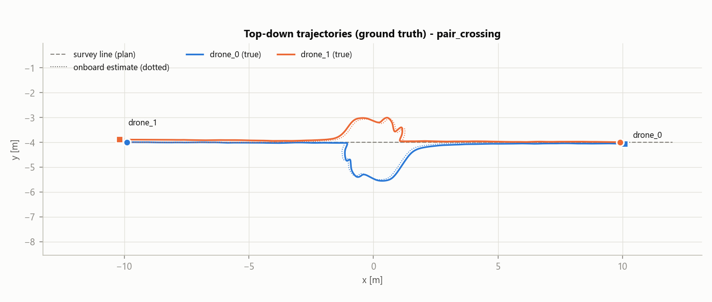
* **Exp 1a/1b - formation under current.** With 0.25 and 0.40 m/s cross-currents (inside the envelope)
  the triangle is kept for the whole survey with a true formation error below 0.09 m (median 0.07 m,
  vs e_ok 0.6 m); no warning, no avoidance.
  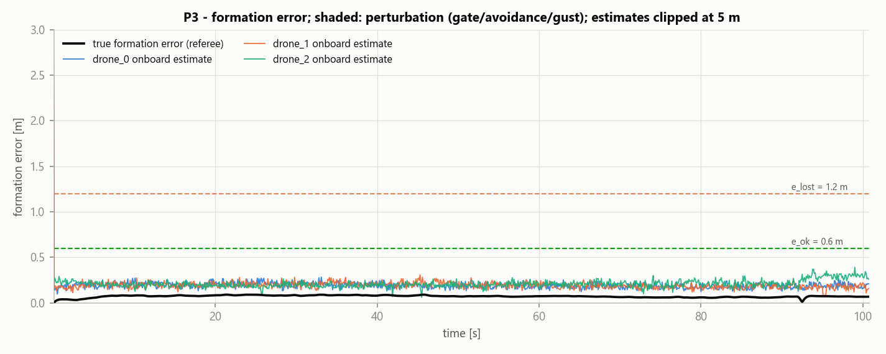
* **Exp 1c - disturbance and recovery.** The 0.8 m/s gust overpowers the right-lane drone (drone_1): it
  **declares an envelope violation itself** (t = 41.3 s, saturated velocity loop) and holds in FAILSAFE
  while it is pushed about 2.5 m across into the centre lane; drone_2, whose lane it enters, switches to
  SEPARATION_WARNING and gives way, drone_0 shifts with the formation. The closest pair stays at 2.45 m.
  The formation is declared lost at t = 43.8 s; drone_1 returns to its lane and the formation is
  recovered at t = 54.3 s, 4.9 s after the perturbation ended (P3 deadline 75 s). The referee flags
  the run as out of the claimed envelope (max drift 1.03 m/s > 0.6 m/s), so this is a robustness
  demonstration, not a proof case.
  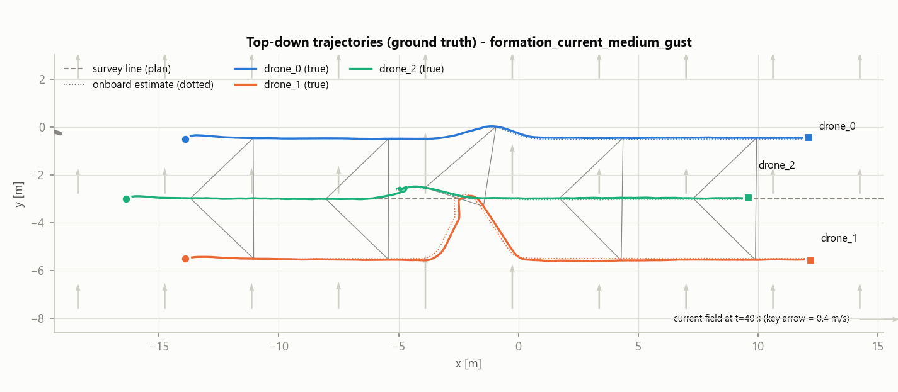
  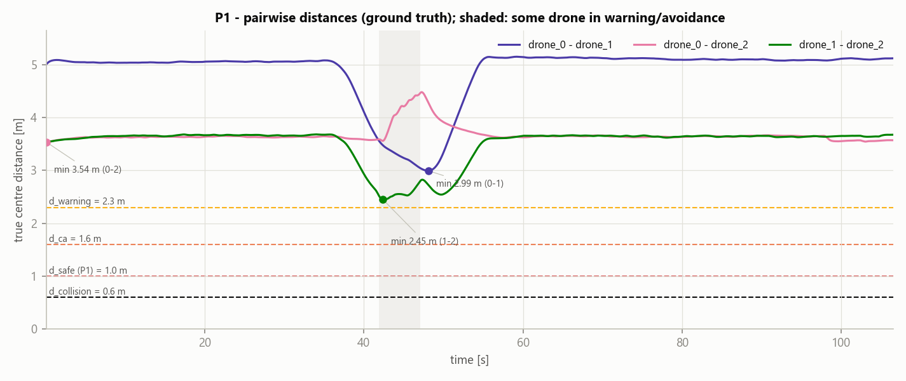
* **Exp 2 - gates, one at a time.** At G06 drone_0 commits first; drone_2 and drone_1 hold their queue
  points or step back as the shared rule dictates (along-track position first, then lateral, then depth)
  and pass after it, one at a time (2 PASS, 5 YIELD, 4 RETRY_PASS decisions over the two gates); the same
  order is reproduced at G07. The critical-region occupancy never exceeds 1 and every drone traverses both
  gates. After the last exit the triangle is rebuilt in its original slots and the formation is recovered
  4.9 s after the end of the perturbation.
  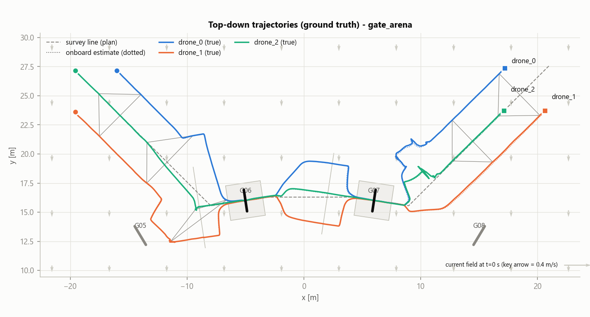
  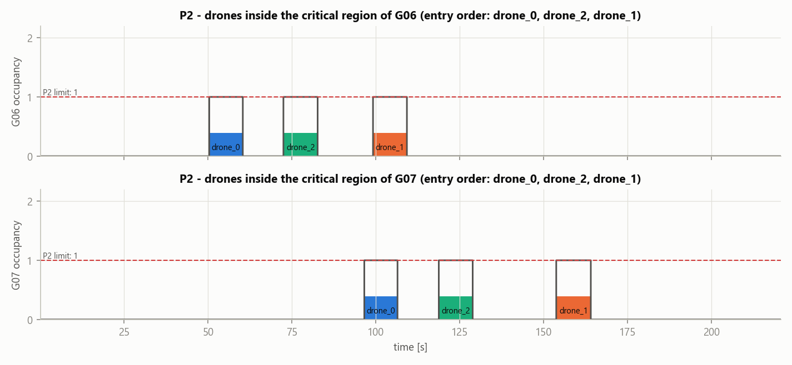
  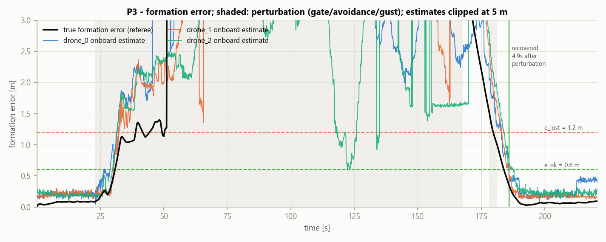
  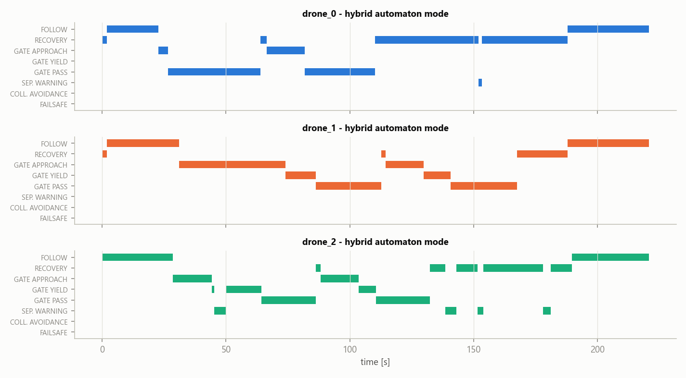
* **Exp 3 - stress, no communication.** The sensing faults (sonar blackouts, stale data under beam
  dropout) produced 37 FAILSAFE entries (9 / 18 / 10 per drone), each one a hold in place plus a move to
  the drone's pre-assigned depth layer, followed by a return to the mission. Drones were released 7 s
  apart, drone_2 flew without forward sonar, currents varied continuously: P1 (2.41 m), P2 (occupancy 1,
  same order as Exp 2) and P3 held. The variable current never stops, so "recovery after the end of the
  perturbation" is undefined here: the fleet re-formed at t = 201.1 s while still perturbed.
  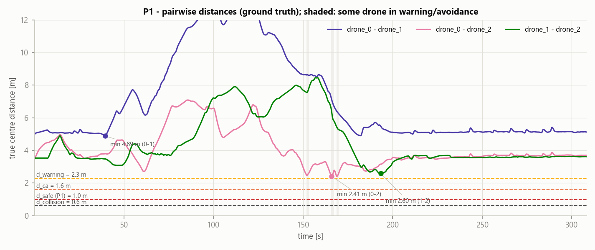
* **Exp 4 - optional communication.** With the channel ON the gate order and the gate decisions
  (identical counts) are unchanged, the minimum distance is comparable (2.45 vs 2.39 m) and the formation
  is recovered at the **same absolute time (t = 186.0 s)** as without communication. The different
  "recovery after perturbation" figure (18.7 vs 4.9 s) only reflects when the last perturbing mode ended in each run
  (t = 167.3 vs 181.1 s); episode durations are 147.4 vs 147.1 s. Safety does not depend on messages,
  and in this mission messages did not even change the timeline.

Scene and sensors (visualisation only, never used by the controllers):

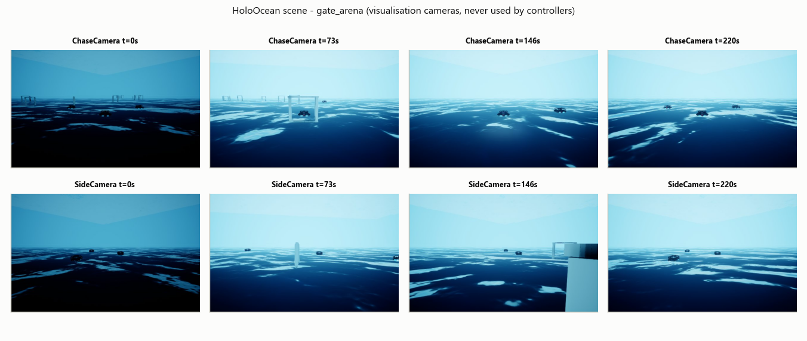
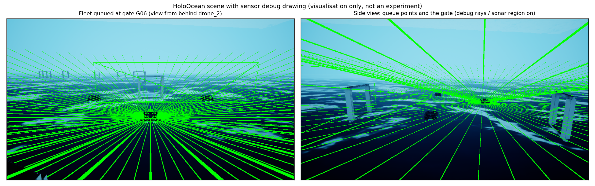
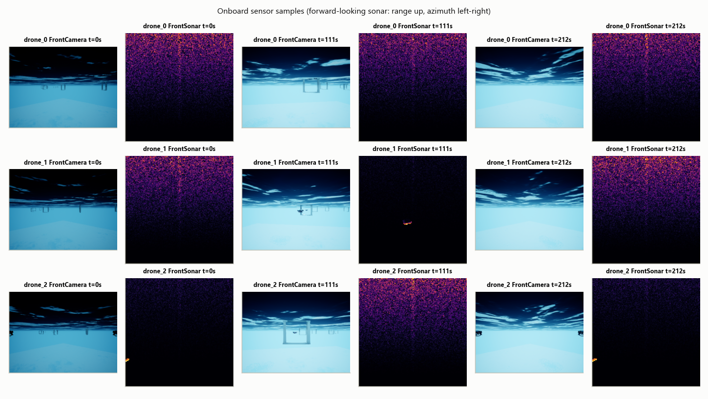
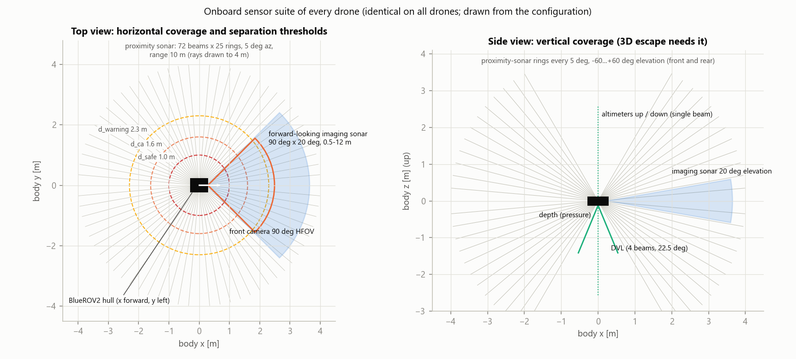

(The forward-sonar images are normalised per frame: frames without an echo show the amplified speckle.)
GIFs: `figures/gate_arena_s0__chasecamera.gif`, `figures/gate_arena_s0__sidecamera.gif`,
`figures/formation_medium_gust_s0__chasecamera.gif`, `figures/pair_crossing_s0__chasecamera.gif`.

## 4. Do the runs satisfy the formal assumptions?

`scripts/validate_assumptions.py` measures, from ground truth vs onboard logs, every assumption of the
proofs ([results/ASSUMPTIONS.md](results/ASSUMPTIONS.md)). Perception errors are measured against the
truth at the acquisition time of the sonar data; the data age is checked separately, as in the P1 model.

| run | A_eps: max abs err xyz within 2.8 m (P1) [m] | p99 abs err 2.8-8 m [m] | detection <= 2.8 m / 2.8-8 m | symmetric detection | max data age [s] | A_hold (needed only for along-tied drones) | A_mono worst margin [m] | max closing speed [m/s] |
|---|---|---|---|---|---|---|---|---|
| pair_crossing_s0 | 0.25 / 0.21 / 0.09 | 0.22 / 0.21 / 0.01 | 100 % / 100 % | 100 % | 0.07 | - | - | 0.79 |
| formation_medium_s0 | - (never closer) | 0.33 / 0.22 / 0.01 | - / 100 % | 100 % | 0.07 | - | - | 0.15 |
| formation_high_s0 | - (never closer) | 0.34 / 0.22 / 0.01 | - / 100 % | 100 % | 0.07 | - | - | 0.21 |
| formation_medium_gust_s0 | 0.28 / 0.17 / 0.07 | 0.34 / 0.21 / 0.02 | 100 % / 100 % | 100 % | 0.07 | - | - | 0.35 |
| gate_arena_s0 | 0.31 / 0.25 / 0.09 | 0.37 / 0.36 / 0.11 | 100 % / 98.1 % | 100 % | 0.07 | not invoked | 0.01 | 0.54 |
| stress_s0 | **0.385** / 0.36 / 0.15 | 0.43 / 0.40 / 0.26 | 100 % / 97.9 % | 100 % | 0.17 | not invoked | 0.01 | 0.86 |
| gate_arena_comms_s0 | 0.31 / 0.30 / 0.05 | 0.38 / 0.34 / 0.11 | 100 % / 98.0 % | 100 % | 0.07 | not invoked | 0.00 | 0.58 |

Bounds: eps_rel 0.35 m, tau_max 0.2 s, mono_tol 0.15 m, c_max 1.05 m/s.

* **Inside the warning band (what P1 needs) every run except the stress run respects the perception
  bound, and every run detects every drone and sees it symmetrically**; data age <= 0.07 s (0.17 s
  under blackout stress) vs tau_max 0.2 s.
* **The stress run exceeds eps inside the warning band (0.385 m)**, as intended by its 25 % beam dropout:
  its P1/P2/P3 successes are empirical evidence, not covered by the proofs.
* **Gate corridor (2.8-8 m, used by P2):** detection 98 %, and for the *fresh* tracks the gate rule uses,
  98.5-98.8 % of the samples are within eps (p99 0.34-0.36 m along-track); a ~1.5 % tail (up to
  ~0.7 m) comes from hulls partially masked by, or occluded behind, gate bars. That tail is outside the
  formal P2 assumption; P2 nevertheless held in all three gate runs (the occupied-zone margins and the
  fresh-track rule absorb it), but this is empirical.
* **A_hold** (queued drones keep their lateral/vertical position while another drone leaves the queue
  line) is needed by lemma M3 only for a drone that was along-tied with the committing one; in these runs
  the drones reached the queue line staggered, so the case never occurred. **A_mono** (during a transit
  window the committed drone's along-track progress minus a queued drone's progress stays >= -0.15 m)
  held: the worst margin was 0.00-0.01 m, i.e. the committed drone never lost ground.

Visual checks performed on every figure: not empty, readable axes, thresholds drawn and labelled, legends
consistent (drone colours fixed across all figures, validated colour-blind-safe palette), trajectories
continuous (max true speed 0.64 m/s), gates at the arena positions, re-formed triangle visible at the end
of every formation and gate run, onboard estimate (dotted) overlapping the truth.

## 5. Acceptance criteria

| # | criterion | status | evidence |
|---|---|---|---|
| 1 | the simulation starts without errors | met | every run in `results/` completed (`referee_metrics.json` -> `run.status`); the HoloOcean engine-start race is handled by a bounded retry |
| 2 | the 3 drones move in HoloOcean | met | trajectories and GIFs of every 3-drone run; referee max true speed 0.64 m/s (no teleport-like jumps) |
| 3 | the controllers do not use ground truth | met | `tests/test_isolation.py` (import graph of `ha/`, `perception/`, `control/`; no ground-truth sensor names; runtime stripping of Pose/Velocity/Collision sensors and visualisation cameras) |
| 4 | no inter-drone communication by default | met | `tests/test_no_comms_default.py`; `inter_agent_messages_sent = 0` in every default run; the optional channel is ON only in `gate_arena_comms_s0` |
| 5 | collision avoidance uses local, sensor-driven logic | met | SW/CA guards on sonar-derived `d_min`; the QP filter and the 3D escape use only perceived threat directions; head-on (Exp 0) and gust (Exp 1c) runs |
| 6 | the gate task re-uses the existing marine arena | met | `holo_fleet/arena_bridge.py` imports `marine_race_arena` (Horseshoe Bay track, GateFactory, HoloOceanVisualSpawner) from the Desktop project; DISCOVERY.md |
| 7 | the referee computes the properties from ground truth only for validation | met | `holo_fleet/referee/referee.py` (the only reader of PoseSensor etc.); nothing flows back to the controllers |
| 8 | at least one scenario shows a disturbed and recovered formation | met | `formation_medium_gust_s0`: lost at t = 43.8 s under the 0.8 m/s gust, recovered at t = 54.3 s (4.9 s after the perturbation); gate runs: lost at the gate approach, recovered 4.9 s (`gate_arena_s0`) and 18.7 s (`gate_arena_comms_s0`) after the perturbation; `figures/*__formation_error.png`, `figures/formation_medium_gust_s0__chasecamera.gif` |
| 9 | at least one scenario shows one-at-a-time passage through a gate | met | `gate_arena_s0`, `stress_s0`, `gate_arena_comms_s0`: max CR occupancy 1 at G06 and G07, entry order drone_0 > drone_2 > drone_1, every drone traversed both gates; `figures/gate_arena_s0__critical_region_occupancy.png`, `figures/gate_arena_s0__sidecamera.gif` |
| 10 | the main formal properties have Z3 / bounded verification scripts | met | `formal/check_properties.py`: 102 checks, all with the expected verdict (section 2) |
| 11 | plots and screenshots generated and checked | met | `figures/` (key figures and GIFs), per-run `results/<run>/figures/`; each figure was inspected (section 4 lists what was checked) |
| 12 | the README explains what was done | met | README.md |

## 6. Design decisions forced by the experiments (what went wrong first, and the fix)

| observation (HoloOcean) | consequence | fix |
|---|---|---|
| imaging sonar does not see runtime-spawned gates | gates invisible to the forward sonar | ray-cast proximity-sonar rings + arena map for gates; forward sonar kept for vehicles |
| `set_ocean_currents` is a force with a strongly nonlinear drift response | "0.3 m/s current" means ~0.01 m/s drift | currents specified as effective drift through a measured calibration table |
| head-on pair stopped nose to nose (warning mode only removed closing velocity) | symmetric deadlock, chattering | warning mode = QP safety filter + right-hand sidestep (antisymmetric) -> port-to-port passing |
| first P1 encoding could not be proved with the original thresholds | warning band too thin for the measured braking + perception delay | thresholds re-derived from the calibration (d_warning 2.3 m, caps 0.40 / 0.50 m/s); k-induction now closes; sensitivity: 2.215 m would suffice |
| weak integral action: 0.14 m/s residual drift at 0.40 m/s current | drone stalled inside a current tail | PI velocity loop with anti-windup; nominal authority 0.40 -> residual 0.002 m/s at 0.40 m/s drift |
| pairwise priority rule could deadlock (both waiting) at band boundaries | found while writing the Z3 lemma M2 | six exclusive decision classes with robust waits and retreats; Z3 proves no mutual waiting |
| first gate run: a drone was driven into gate G05 (9 m before G06 on its axis) | approach corridor intersected the arena's previous gate | approach zone shortened, structure safety filter added to every mode |
| visualisation cameras looked up (pitch sign) and above water | useless frames | `probe/probe_cameras.py`; chase/side cameras with positive-down pitch |
| head-on neighbour estimates were ~+0.2 m too far | unsafe-side bias in the most dangerous encounter | calibration probe (`probe/probe_perception_bias.py`): the centroid of the hull returns sinks behind the near face; estimator changed to centroid *direction* x (nearest return + 0.2 m): static error -0.19...+0.09 m for every aspect; the rest was sonar data age (~0.1 s x closing speed), which the P1 model covers through c_max*tau; eps set to the measured 0.35 m, all margins re-derived, batch re-run |
| with eps 0.35 m the vertical tie-break of the gate rule became breakable by depth holding | Z3 counterexample to M3 (both drones see themselves "higher" at different times) | mu_z 0.6 -> 0.75 m |
| thresholds precomputed in Python floats | Z3 found a 1e-16 gap between two decision classes (spurious counterexample) | exact rationals for every constant in the gate encoding |
| gate run with exit order 0 > 2 > 1: two drones stood off for 180 s after the gates (P3 failed) | lanes 1.75 m apart (< d_warning 2.3 m): re-ordering along the line required passing inside the warning band, and the head-on sidestep rule pushed the overtaking drone backwards | formation lanes at +/-2.5 m (> d_warning, overtaking on one's own lane never triggers the warning); sidestep side follows the mission velocity except head-on |
| right-lane drone came within ~1 m of gate G05 while moving to its G06 queue point | approach leg too shallow for the wider lanes | approach / exit headings (-45 / +45 deg) chosen numerically for >= 3 m clearance from every other gate |
| P3 BMC with a tolerance that ignored the tracking residual never closed | unreachable target | ranking-function proof with tolerances derived from the worst-case noise gain |

## 7. Limits (what this proof of concept does not show)

* **Abstraction gap.** The proofs are on discrete-time abstractions with calibrated bounds (velocity-level
  plant, bounded perception error and staleness, symmetric detection). HoloOcean is checked against those
  assumptions run by run, not proved to satisfy them. Perception near gates degrades (partial masking by
  the bars, long-range occlusion): inside the warning band the bound held in every run except the
  stress run (25 % beam dropout); in the
  2.8-8 m gate corridor about 1.5 % of the fresh-track samples used by the gate rule (about 3 % of all
  samples) exceed it. The fresh-track rule and the occupied-zone margins absorbed this in our runs, but
  that is empirical, not proved.
* **Three drones.** The geometric lemma S3 and the pairwise gate rule are written for three vehicles;
  larger fleets need an n-vehicle generalisation (the decision rule is pairwise and extends, the triangle
  lemma does not directly).
* **Static rank as last resort.** Complete ties in the gate rule are broken by a pre-configured rank (no
  messages); it never fired in the runs (the robust classes did: in `gate_arena_s0` the logs contain
  143 rear-retreat, 13 right-retreat, 20 front-wait and 170 robust-wait decisions, all resolved), but it
  is a design-time agreement.
* **Mission knowledge.** Drones know the survey line, the formation template and the gate map (an
  operator upload before the dive) and start from a surveyed launch pose; navigation is DVL dead reckoning
  without external fixes (in `gate_arena_s0` the estimate stayed within 0.18 m of the truth over 52-58 m
  of path; HoloOcean's DVL noise model is optimistic, drift would be larger at sea).
* **Simulation fidelity.** HoloOcean's current model, sonar models (ray-cast rings are an idealised
  omnidirectional obstacle-avoidance sonar), and BlueROV2 dynamics are not validated against hardware.
* **Statistics.** One seed per scenario; the runs demonstrate the mechanisms, they are not a statistical
  campaign.

## 8. Next steps

1. Seeds x scenarios campaign (the runner is seed-parameterised) with confidence intervals on minimum
   distance, waiting times and recovery times.
2. n-drone generalisation of the separation composition lemma and of the queue geometry.
3. Replace the ray-cast rings with a realistic multibeam obstacle-avoidance sonar model and re-measure eps.
4. Feed the formal assumptions to a runtime monitor (simplex-style): the drone already declares
   `ENVELOPE_VIOLATION`; extend it to perception-error and staleness assumptions.
5. Hardware-in-the-loop with BlueROV2 units in a tank, re-using the referee as an external tracking system.

## 9. Reproducing

Commands are in [README.md](README.md#5-commands). `python scripts/run_all.py` re-runs the plant
calibration, the seven demonstrative runs, the analysis, the figures and the assumption validation;
`python formal/check_properties.py` regenerates `formal/results/`. The repository versions metrics,
events, per-drone states, referee time series and the key figures; per-step observation/action logs, raw
camera frames, sensor dumps and per-run figures stay on disk and are regenerated by the scripts.
